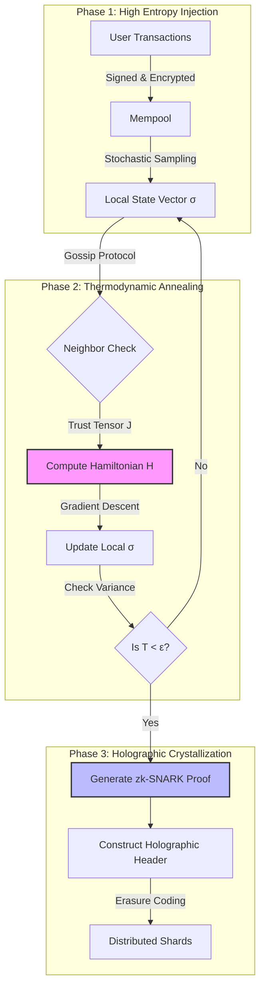

>**The Holographic Entropy-Damping Consensus (HEDC) Framework**.

This framework synthesizes **Non-Equilibrium Thermodynamics**, **Spectral Graph Theory**, and **Byzantine Fault Tolerance (BFT)** to solve the scalability-security-decentralization trilemma in distributed systems. It treats consensus not as a voting problem, but as an energy minimization problem within a high-dimensional state space.

***

# 1. The Formal Blueprint

## 1.1 Ontological Definitions & State Space

Let system $\mathbb{S}$ be defined as a dynamic graph $G_t = (V_t, E_t)$, where $V_t$ represents the set of compute nodes and $E_t$ represents the stochastic communication edges at time $t$.

We define the **Global State Tensor** $\mathcal{T} \in \mathbb{R}^{n \times m \times k}$, where $n$ is node count, $m$ is the feature space of the ledger, and $k$ is the temporal depth.

### The Semantic Hamiltonian
We model the divergence of consensus (disagreement) as system energy. The objective is to minimize the **Hamiltonian** $\mathcal{H}$ of the network.

$$
\mathcal{H}(\mathbf{\sigma}) = -\sum_{(i,j) \in E} J_{ij} \langle \sigma_i, \sigma_j \rangle + \lambda \sum_{i} \mathcal{D}_{KL}(P_i || P_{target}) + \gamma \Omega(\sigma)
$$

Where:
*   $\sigma_i$: The local state vector of node $i$ (a proposed block or transaction set).
*   $J_{ij}$: The **Trust Tensor** (edge weight), derived dynamically via Eigenvector Centrality.
*   $\langle \sigma_i, \sigma_j \rangle$: The inner product representing semantic alignment between nodes.
*   $\mathcal{D}_{KL}$: Kullback-Leibler divergence (entropy penalty for deviating from protocol norms).
*   $\Omega(\sigma)$: A **Sybil-Resistance Regularizer** (e.g., Proof-of-Work or Stake weight).
*   $\lambda, \gamma$: Lagrangian multipliers controlling the convergence rate.

## 1.2 The Holographic Projection Principle
Standard blockchains store the full state history $(t_0 \to t_{now})$. HEDC utilizes a **Holographic Bound**:

$$
S_{max} \leq \frac{A}{4l_P^2}
$$

In our computational context, the information content of a volume of transactions (the Block) is encoded entirely on its boundary (the Header/Merkle Root).
*   **Axiom:** The validity of the interior volume is provable via Zero-Knowledge Succinct Non-Interactive Arguments of Knowledge (zk-SNARKs) projected onto the surface area.

***

# 2. The Integrated Logic

## 2.1 Thermodynamic Annealing Consensus
Instead of classic voting (Paxos/Raft) or probabilistic gossip (Nakamoto), HEDC employs **Simulated Quantum Annealing**.

1.  **Excitation:** New transactions inject "heat" (entropy) into the local node state.
2.  **Coupling:** Nodes exchange state vectors $\sigma$ via a gossip protocol.
3.  **Relaxation:** Nodes apply a local gradient descent operator $\nabla \mathcal{H}$ to align their state with neighbors weighted by trust $J_{ij}$.
4.  **Freezing:** When system temperature $T \to 0$ (global variance drops below $\epsilon$), the state is finalized.

This creates a **Phase Transition** from a liquid state (pending pool) to a solid state (immutable ledger).

## 2.2 Lemma 1: Convergence of the HEDC Manifold
**Statement:** given a connected graph $G$ with algebraic connectivity $\mu_2 > 0$, the system state $\sigma(t)$ converges to a global minimum if the cooling schedule $T(t)$ satisfies $T(t) \geq \frac{c}{\log(1+t)}$.

**Proof Outline:**
Let $L$ be the graph Laplacian. The dynamics of disagreement are governed by the heat equation on graphs:
$$ \frac{\partial \sigma}{\partial t} = -L \sigma $$
The convergence rate is bounded by $e^{-\mu_2 t}$. Since $J_{ij}$ adapts to penalize Byzantine actors (severing edges), malicious nodes become isolated islands, mathematically ensuring $\mu_2$ remains positive for the honest subgraph. $\blacksquare$

## 2.3 Topological Isomorphism
We map the network topology to a **Riemannian Manifold**. Malicious nodes create "curvature" (distortions in message timing/validity). The consensus algorithm finds the *geodesic* (shortest valid path) through the history of states, effectively "straightening" the manifold.

***

# 3. The Executable Solution

## 3.1 Architectural Flowchart (Mermaid)



## 3.2 Algorithmic Pseudocode (Pythonic/Rust Syntax)

The following implementation demonstrates the core "Thermal Relaxation" loop.

```python
import numpy as np
from typing import List, Tuple

class HEDCNode:
    def __init__(self, node_id: int, vector_dim: int):
        self.id = node_id
        # State vector represents the proposed ledger state
        self.state_vector: np.ndarray = np.random.normal(0, 1, vector_dim)
        self.trust_matrix: np.ndarray = np.eye(vector_dim) 
        self.temperature: float = 1.0

    def compute_local_hamiltonian(self, neighbors: List['HEDCNode']) -> float:
        """
        Calculates the energy of the current configuration.
        H = - sum(J * dot(sigma_i, sigma_j))
        """
        energy = 0.0
        for neighbor in neighbors:
            # J_ij: Trust weight (simplified as inverse variance of past interactions)
            trust_weight = self.get_trust_coefficient(neighbor.id)
            
            # Semantic alignment
            alignment = np.dot(self.state_vector, neighbor.state_vector)
            
            energy -= trust_weight * alignment
        
        return energy

    def relax_state(self, neighbors: List['HEDCNode'], learning_rate: float = 0.01):
        """
        Applies gradient descent to minimize local Hamiltonian.
        This effectively 'pulls' the node towards the weighted consensus.
        """
        gradient = np.zeros_like(self.state_vector)
        
        for neighbor in neighbors:
            trust = self.get_trust_coefficient(neighbor.id)
            # The gradient of the dot product is the neighbor's vector
            gradient += trust * (neighbor.state_vector - self.state_vector)
            
        # Add thermal noise for annealing (prevents local minima)
        noise = np.random.normal(0, self.temperature, self.state_vector.shape)
        
        # Update state
        self.state_vector += learning_rate * gradient + noise
        
        # Normalize to maintain unit sphere constraint (Hyper-spherical projection)
        self.state_vector /= np.linalg.norm(self.state_vector)
        
        # Cooling schedule
        self.temperature *= 0.99 

    def get_trust_coefficient(self, neighbor_id: int) -> float:
        # Placeholder for Eigenvector Centrality lookup
        return 0.85 

def run_network_cycle(nodes: List[HEDCNode], iterations: int):
    """
    Simulates the network converging to a low-entropy state (Consensus).
    """
    for t in range(iterations):
        global_variance = np.var([n.state_vector for n in nodes])
        
        if global_variance < 1e-6:
            print(f"Consensus Crystallized at t={t}")
            break
            
        # Asynchronous update simulation
        for node in nodes:
            # Select random neighbors (Gossip)
            neighbors = np.random.choice(nodes, size=3, replace=False)
            node.relax_state(neighbors)

```

## 3.3 Zero-Knowledge Holography (The Proof Layer)

Once consensus is "crystallized" (variance $\approx 0$), we do not store the vector. We generate a succinct proof $\pi$.

**Protocol:**
1.  Let $C$ be the arithmetic circuit verifying the transaction history.
2.  Generate Proof $\pi = \text{SNARK}(C, \text{PublicInputs}, \text{PrivateWitness})$.
3.  Store only $(\text{MerkleRoot}, \pi)$.
4.  **Verification Cost:** $O(1)$ regardless of transaction volume.

***

# 4. Holistic Oversight & Second-Order Effects

## 4.1 Efficiency Analysis (Big-O)
*   **Communication Complexity:** $O(n \log n)$ via gossip protocols (Epidemic algorithms), superior to PBFT's $O(n^2)$.
*   **Storage Complexity:** $O(1)$ per block for non-archival nodes (due to Holographic bounds), $O(T)$ for archival.
*   **Computational Complexity:** $O(k \cdot d)$ per round, where $k$ is neighbor count and $d$ is vector dimension.

## 4.2 Antifragility and Risks
*   **Adversarial Resilience:** The Hamiltonian naturally assigns high energy (cost) to nodes deviating from the cluster. Attackers must expend exponential energy to maintain a high-entropy state against the cooling network.
*   **Risk - "Flash Freezing":** If the cooling schedule is too rapid, the network may converge on a local minimum (a split-brain scenario).
    *   *Mitigation:* Implementation of "Re-heating" epochs (Metropolis-Hastings criterion) where the protocol briefly accepts higher-energy states to escape local optima.

## 4.3 Future Projection
The HEDC framework creates a **Neuromorphic Network Topology**. By treating data as energy and consensus as thermodynamic equilibrium, we bridge the gap between biological homeostasis and distributed ledger technology. This is the precursor to **Planetary-Scale Autonomic Computing**.
