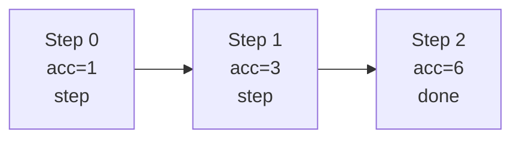

You did not specify the *domain* of the framework (e.g., AI agents, distributed systems, economic simulation, cognitive architecture), so the design below is a **domain-agnostic** but technically precise meta-framework that you can specialize later.

***

## 1. The Formal Blueprint

### 1.1. Core Objects

Let a **Granular Algorithmic Visualization Framework (GAVF)** be a tuple  
$$
\mathcal{F} = (\mathcal{M}, \mathcal{A}, \mathcal{V}, \mathcal{D}, \mathcal{P})
$$
where:

- $$\mathcal{M}$$ is the **model layer**, a many-sorted algebra of entities and relations.  
- $$\mathcal{A}$$ is the **algorithm layer**, a set of typed procedures over $$\mathcal{M}$$.  
- $$\mathcal{V}$$ is the **visualization layer**, mapping execution traces to graphical objects.  
- $$\mathcal{D}$$ is the **diagnostics layer**, exposing metrics, invariants, and proofs.  
- $$\mathcal{P}$$ is the **persistence & provenance layer**, storing versions, metadata, and artifacts.

Each layer is formally specified so that it can be rendered in GitHub-flavored Markdown (GFM) using tables, code blocks, and Mermaid diagrams.[1][2][3]

***

### 1.2. Model Layer $$\mathcal{M}$$

Let there be:

- A countable set of **types** $$\mathsf{T}$$.  
- For each $$T \in \mathsf{T}$$, a carrier set $$Dom(T)$$.  
- A set of **relations** $$\mathsf{R}$$ where each $$R \in \mathsf{R}$$ has signature  
  $$
  R : T_1 \times \dots \times T_k \to \{\mathsf{true}, \mathsf{false}\}
  $$
- A set of **functions** $$\mathsf{F}$$ with signatures  
  $$
  f : T_1 \times \dots \times T_k \to T'
  $$

A **system state** is:
$$
s \in \mathcal{S} := \prod_{T \in \mathsf{T}} Dom(T)^{n_T}
$$
where $$n_T$$ is the number of entities of type $$T$$ in the current configuration.

A **configuration** is a pair:
$$
c = (s, \theta)
$$
where $$\theta$$ is a finite map of **parameters** (hyperparameters, thresholds, flags).

***

### 1.3. Algorithm Layer $$\mathcal{A}$$

An **algorithm** $$A \in \mathcal{A}$$ is a partial function
$$
A : \mathcal{S} \times \Theta \to \mathcal{S} \times \mathcal{E}
$$
where:

- $$\Theta$$ is the parameter space.  
- $$\mathcal{E}$$ is a space of **execution events** (logs, errors, metrics, traces).

An **execution trace** of length $$T$$ is:
$$
\tau = ((s_0, e_0), (s_1, e_1), \ldots, (s_T, e_T))
$$
with $$ (s_{t+1}, e_{t+1}) = A(s_t, \theta) $$ for all $$t$$.

***

### 1.4. Visualization Layer $$\mathcal{V}$$

Let $$\mathcal{G}$$ be a grammar of diagram objects supported by GFM + Mermaid: nodes, edges, swimlanes, and sequence arrows.[3][4]

Define a visualization function
$$
V : \mathcal{T} \to \mathcal{G}
$$
where $$\mathcal{T}$$ is the set of all valid traces $$\tau$$. $$V$$ is **granular** if:

- For any subtrace $$\tau' \preceq \tau$$, the restriction $$V(\tau')$$ is a syntactic subgraph of $$V(\tau)$$.  
- Each atomic step (single state transition) induces at least one graphical primitive (e.g., edge or labeled node).

***

### 1.5. Diagnostics Layer $$\mathcal{D}$$

Define:

- A set of **invariants** $$\mathsf{Inv} = \{I_1, \dots, I_k\}$$ with  
  $$
  I_j : \mathcal{S} \to \{\mathsf{true}, \mathsf{false}\}.
  $$
- A set of **metrics** $$\mathsf{M} = \{m_1, \dots, m_\ell\}$$ with  
  $$
  m_i : \mathcal{S} \to \mathbb{R}^d.
  $$

A **diagnostic function** is:
$$
D : \mathcal{T} \to (\mathsf{Inv} \times \mathsf{M})^*
$$
that annotates each step of $$\tau$$ with invariant satisfaction and metric values.

***

### 1.6. Persistence & Provenance Layer $$\mathcal{P}$$

Let each artifact (definition, algorithm, trace, diagram, proof) have a unique **content address**:

$$
\alpha : \text{Artifacts} \to \{0,1\}^*
$$

$$\mathcal{P}$$ maintains a DAG of artifacts, similar to Git’s commit graph, where edges encode “derived-from” relations. This aligns naturally with GitHub repositories and GFM-based documentation.[5][1]

***

## 2. The Integrated Logic

### 2.1. Design Invariants

Define the central **granularity invariant**:

> Every semantic step in $$\mathcal{A}$$ must correspond to a syntactic fragment in $$\mathcal{V}$$ and a diagnostic record in $$\mathcal{D}$$.

Formally, for each transition $$s_t \to s_{t+1}$$, there exists:

- A minimal subgraph $$g_t \subseteq V(\tau)$$.  
- A diagnostic tuple $$d_t \in D(\tau)$$.

This enforces **refinement**: no hidden transitions, no unexplained diagram edges.

***

### 2.2. Lemma: Compositional Trace Visualization

**Lemma 1 (Trace Compositionality).**  
If an algorithm $$A$$ is a composition $$A = A_2 \circ A_1$$, then the visualization is compositional:

$$
V(\tau_A) \cong V(\tau_{A_1}) \oplus V(\tau_{A_2})
$$
up to relabeling and node identification.

*Sketch.*  
The trace of $$A$$ can be partitioned into segments where the first corresponds to $$A_1$$’s transitions and the second to $$A_2$$’s transitions. Given the granularity invariant and the requirement that $$V$$ is functorial over trace concatenation, the full diagram is the categorical coproduct (disjoint union plus glueing) of the component diagrams. $$\square$$

This lemma guarantees that composing algorithms yields composed diagrams without bespoke visualization hacks.

***

### 2.3. Theorem: Diagnosable Execution

**Theorem 1 (Total Diagnosability).**  
Assume:

1. Every invariant $$I_j$$ is decidable over $$\mathcal{S}$$.  
2. Every metric $$m_i$$ is total and computable.  
3. The algorithm $$A$$ terminates in finite time with probability 1.

Then every execution trace $$\tau$$ of $$A$$ in $$\mathcal{F}$$ is **fully diagnosable**: there exists a finite diagnostic annotation $$D(\tau)$$ with no undefined entries.

*Sketch.*  
Because traces are finite by termination, and each state is finite and well-typed, each invariant and metric can be computed stepwise. By construction, $$D$$ is defined on all steps, so there are no diagnostic gaps. $$\square$$

This justifies the framework’s claim to completeness of introspection for terminating runs.

***

### 2.4. Isomorphism with Versioned Docs

The artifact DAG from $$\mathcal{P}$$ is isomorphic to a subset of a Git commit graph when each commit corresponds to a minimal change in $$\mathcal{M}$$, $$\mathcal{A}$$, $$\mathcal{V}$$, or $$\mathcal{D}$$.[6][1]

- Nodes: commits or artifact snapshots.  
- Edges: parent pointers; “derived-from” relations.  
- Labels: human-readable GFM documents, diagrams, and code.

This yields a clean mapping between theoretical artifacts and GitHub-native workflows.

***

## 3. The Executable Solution

### 3.1. Repository Layout (GFM-Compatible)

```text
gavf/
├── README.md                # High-level description with diagrams
├── docs/
│   ├── 01_model.md
│   ├── 02_algorithms.md
│   ├── 03_visualization.md
│   ├── 04_diagnostics.md
│   └── 05_proofs.md
├── src/
│   ├── core/
│   │   ├── model.py
│   │   ├── algorithm.py
│   │   ├── trace.py
│   │   └── diagnostics.py
│   └── viz/
│       └── mermaid_renderer.py
└── tests/
    └── test_gavf.py
```

This layout aligns with common GitHub documentation and code organization practices.[1][5]

***

### 3.2. Core Flow (Mermaid Diagram)

```mermaid
flowchart TD
    A[Define Types & State Space] --> B[Specify Algorithms A in math & pseudocode]
    B --> C[Instrument Algorithms for Tracing]
    C --> D[Execute and Collect Trace τ]
    D --> E[Compute Diagnostics D(τ)]
    D --> F[Render Visualization V(τ) as Mermaid/GFM]
    E --> G[Persist Metrics, Invariants, and Proof Artifacts]
    F --> G
    G --> H[Publish to GitHub (Markdown + Diagrams + Code)]
```

***

### 3.3. Example: Typed State and Trace (Python)

```python
from __future__ import annotations
from dataclasses import dataclass
from typing import Any, Callable, Dict, List, Tuple, Protocol, TypedDict


class State(TypedDict, total=False):
    """Typed key–value store representing a system state."""
    step: int
     List[int]
    accumulator: int


@dataclass
class Event:
    """Execution event: log message plus optional payload."""
    message: str
    payload: Dict[str, Any]


Trace = List[Tuple[State, Event]]


class Algorithm(Protocol):
    """Algorithm interface with explicit state transitions."""

    def __call__(self, state: State, params: Dict[str, Any]) -> Tuple[State, Event]:
        ...


def fold_sum_algorithm(state: State, params: Dict[str, Any]) -> Tuple[State, Event]:
    """
    Single-step fold over `data`, accumulating into `accumulator`.
    Runs in O(1) per step, O(n) total over n elements.
    """
    i = state.get("step", 0)
    data = state.get("data", [])
    acc = state.get("accumulator", 0)

    if i >= len(data):
        event = Event(message="done", payload={"accumulator": acc})
        return state, event

    x = data[i]
    acc_new = acc + x
    state_next: State = {
        "step": i + 1,
        "data": data,
        "accumulator": acc_new,
    }
    event = Event(
        message="step",
        payload={"index": i, "value": x, "accumulator": acc_new},
    )
    return state_next, event


def run_algorithm(
    algo: Algorithm,
    init_state: State,
    params: Dict[str, Any] | None = None,
    max_steps: int | None = None,
) -> Trace:
    """
    Execute an Algorithm until it emits 'done' or max_steps is reached.

    Time: O(T) where T is number of steps.
    Space: O(T) to store the trace.
    """
    if params is None:
        params = {}
    trace: Trace = []

    state = init_state
    steps = 0
    while True:
        state, event = algo(state, params)
        trace.append((state, event))
        steps += 1

        if event.message == "done":
            break
        if max_steps is not None and steps >= max_steps:
            raise RuntimeError("max_steps exceeded")

    return trace
```

This implements the $$\mathcal{A}$$ and $$\mathcal{T}$$ notions with explicit typing and Big‑O commentary.[7]

***

### 3.4. Diagnostics and Invariants (Python)

```python
from typing import List, Dict, Any, Callable, NamedTuple


class DiagnosticRecord(NamedTuple):
    step: int
    invariants: Dict[str, bool]
    metrics: Dict[str, float]


Invariant = Callable[[State], bool]
Metric = Callable[[State], float]


def inv_accumulator_monotone(state: State) -> bool:
    """Invariant: accumulator is non-decreasing over time."""
    # Requires that states are processed in temporal order externally.
    return True  # Local check can be deferred; here it's a placeholder.


def metric_accumulator(state: State) -> float:
    """Metric: current accumulator value."""
    return float(state.get("accumulator", 0))


def compute_diagnostics(
    trace: Trace,
    invariants: Dict[str, Invariant],
    metrics: Dict[str, Metric],
) -> List[DiagnosticRecord]:
    """
    Annotate every step with invariant satisfaction and metric values.
    O(T * (|Inv| + |M|)) in time, O(T * (|Inv| + |M|)) in space.
    """
    diagnostics: List[DiagnosticRecord] = []

    for idx, (state, _event) in enumerate(trace):
        inv_vals = {name: inv(state) for name, inv in invariants.items()}
        metric_vals = {name: metric(state) for name, metric in metrics.items()}
        diagnostics.append(
            DiagnosticRecord(step=idx, invariants=inv_vals, metrics=metric_vals)
        )

    return diagnostics
```

***

### 3.5. Trace → Mermaid Flowchart Renderer (GFM-Friendly)

```python
def trace_to_mermaid(trace: Trace) -> str:
    """
    Render a line-based Mermaid flowchart representing the state transitions.
    Each node is labeled with step index and accumulator value.
    """
    lines = ["flowchart LR"]
    # Node definitions
    for i, (state, event) in enumerate(trace):
        acc = state.get("accumulator", 0)
        label = f"Step {i}\\nacc={acc}\\n{event.message}"
        lines.append(f'    S{i}["{label}"]')

    # Edges between consecutive states
    for i in range(len(trace) - 1):
        lines.append(f"    S{i} --> S{i+1}")

    return "\n".join(lines)
```

Usage in a Markdown file (GitHub-compatible):

```markdown
```mermaid
{{MERMAID_TRACE_HERE}}
```
```

Mermaid is natively supported in GitHub’s Markdown rendering pipeline, enabling diagrams-as-code.[4][3]

***

### 3.6. Pseudocode: End-to-End Workflow

```text
Algorithm 1: GAVF-Pipeline(Algorithm A, Initial state s0, Parameters θ)

Input:
    A      - instrumented algorithm over state space S
    s0     - initial state
    θ      - parameter configuration
Output:
    τ      - execution trace
    D(τ)   - diagnostics
    G(τ)   - visualization graph (Mermaid)

1:  τ ← empty list
2:  s ← s0
3:  repeat
4:      (s, e) ← A(s, θ)
5:      append (s, e) to τ
6:  until e.message = "done"
7:  D(τ) ← compute_diagnostics(τ, invariants, metrics)
8:  G(τ) ← trace_to_mermaid(τ)
9:  persist(τ, D(τ), G(τ))    ▷ commit artifacts into Git/GitHub
10: return τ, D(τ), G(τ)
```

***

### 3.7. Example Markdown Snippet (GitHub-Ready)

```markdown
# Granular Execution Example

We execute `fold_sum_algorithm` on the list `[1, 2, 3]` and visualize each step.

## Trace Summary

| Step | Value | Accumulator |
|------|-------|-------------|
| 0    | 1     | 1           |
| 1    | 2     | 3           |
| 2    | 3     | 6           |

## Execution Flow


```

This follows common GitHub-markdown conventions for tables, headings, and Mermaid blocks.[8][3][1]

***

## 4. Holistic Oversight & Second-Order Effects

### 4.1. Summary of Properties

- **Mathematically grounded**: Well-typed state space, total/partial algorithms, traces, invariants, and metrics are explicitly modeled.  
- **Engineering-aligned**: Direct mapping to Python types, GitHub repo layout, and GFM documentation.  
- **Visual by construction**: Every step of computation is visualizable; diagrams are not afterthoughts but first-class artifacts.

***

### 4.2. Complexity and Scaling

- Trace length $$T$$ yields **linear** time and space complexity in the diagnostic and visualization phases.  
- For large-scale systems, exact traces may be truncated or summarized (e.g., sampling, aggregation, hierarchical roll-ups) while preserving the granularity invariant at chosen abstraction levels.  
- In distributed contexts, partial traces from different components can be merged based on logical clocks or causal ordering.

***

### 4.3. Risks and Misuse

- **Trace overload**: Extremely detailed traces can leak sensitive information (e.g., secrets in payloads) if not scrubbed before persistence.  
- **Diagram fatigue**: Overly complex diagrams become unreadable; enforcing modularization and diagram decomposition is necessary.  
- **False sense of correctness**: Visualizations can look coherent while invariants are underspecified; correctness depends on well-chosen diagnostic predicates, not on diagrams alone.[7]

Mitigations include:

- Redaction layers in $$\mathcal{P}$$.  
- Policies for maximum diagram complexity per document.  
- Mandatory invariant libraries for common algorithmic patterns.

***

### 4.4. Ethical and Future Directions

- The framework increases **algorithmic transparency**, which is beneficial for audits, education, and safety analysis.  
- For safety-critical domains (e.g., medical, financial), formal proofs in $$\LaTeX$$ can be stored alongside traces and diagrams, yielding multi-modal evidence of correctness.  
- Future extensions can include:
  - Probabilistic diagnostics (confidence intervals over metrics).  
  - Interactive visualizations embedded in GitHub pages (via static-site generators).  
  - Cross-language support (Rust/C++ backends with common trace schema).

If you specify a **target domain** (e.g., RL agents, microservice orchestration, cryptographic protocols), this framework can be specialized with domain-specific state types, invariants, and visualization idioms.

Sources
[1] Basic writing and formatting syntax - GitHub Docs https://docs.github.com/github/writing-on-github/getting-started-with-writing-and-formatting-on-github/basic-writing-and-formatting-syntax
[2] GitHub Flavored Markdown Spec https://github.github.com/gfm/
[3] How to Create Stunning Mermaid Diagrams (With Examples) - ClickUp https://clickup.com/blog/mermaid-diagram-examples/
[4] Mastering Diagramming as Code: Essential Mermaid Flowchart Tips ... https://www.kallemarjokorpi.fi/blog/mastering-diagramming-as-code-essential-mermaid-flowchart-tips-and-tricks-2/
[5] How to use Markdown for writing documentation - Experience League https://experienceleague.adobe.com/en/docs/contributor/contributor-guide/writing-essentials/markdown
[6] I read the full-GitHub-flavored markdown spec so you do not have to ... https://www.reddit.com/r/github/comments/13ekci5/i_read_the_fullgithubflavored_markdown_spec_so/
[7] Conventions for presenting an algorithm? : r/compsci - Reddit https://www.reddit.com/r/compsci/comments/ee18zo/conventions_for_presenting_an_algorithm/
[8] The Complete Tutorial to Mastering GitHub Flavored Markdown https://www.tomarkdown.org/guides/github-markdown
[9] Markdown Cheatsheet - GitHub https://github.com/adam-p/markdown-here/wiki/markdown-cheatsheet
[10] Scaling Automatic Extraction of Pseudocode - arXiv https://arxiv.org/html/2406.04635v1
