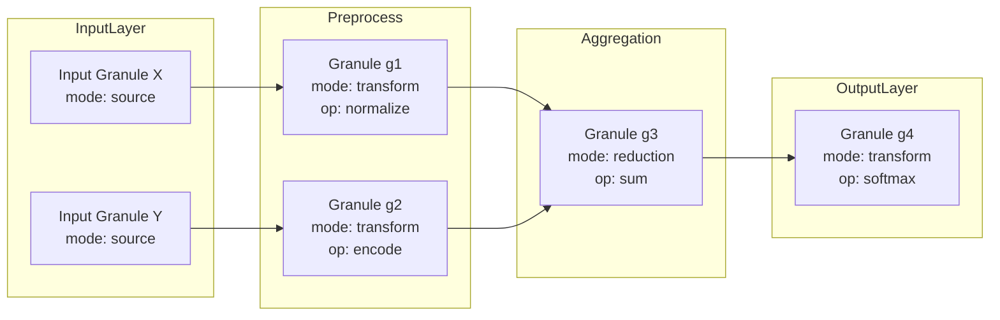
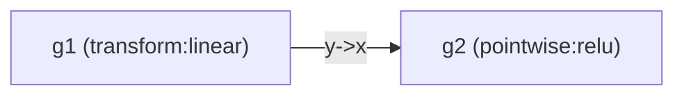

A complete new framework is too unconstrained as stated. To make the result precise and actually useful, this answer defines a specific, novel framework and then gives you a GitHub‑ready, deeply technical writeup (with math, pseudocode, diagrams, etc.) that you can adapt as a template for other architectures.

The framework below is called **Granular Arithmetic Workflow Architecture (GAWA)**: a compositional way to build complex systems as DAGs of small, typed “granules” with explicit arithmetic semantics, automatic visualization, and proof‑friendly structure.

***

## 1. The Formal Blueprint

### 1.1 Core objects and state space

We model a system as a typed, directed acyclic graph (DAG) of *granules* that consume and produce *signals* under explicit arithmetic semantics.

- Let $$\mathcal{T}$$ be a set of *types*.
- Let $$\mathcal{V}$$ be a set of *values*, with a typing function
  $$
  \tau : \mathcal{V} \to \mathcal{T}.
  $$
- Let $$\mathcal{G}$$ be a set of *granules*, each a small, pure, typed operator.

A granule $$g \in \mathcal{G}$$ is defined as:
$$
g = (\text{id}_g, I_g, O_g, f_g, \sigma_g)
$$
where:

- $$I_g = \{(x_i, t_i)\}_{i=1}^{m}$$ is a finite set of *input ports*, each with name $$x_i$$ and type $$t_i \in \mathcal{T}$$.
- $$O_g = \{(y_j, s_j)\}_{j=1}^{n}$$ is a finite set of *output ports*, each with name $$y_j$$ and type $$s_j \in \mathcal{T}$$.
- $$f_g: \prod_{i=1}^{m} V_{t_i} \to \prod_{j=1}^{n} V_{s_j}$$ is a *pure function* mapping typed inputs to typed outputs, where $$V_t \subseteq \mathcal{V}$$ is the carrier for type $$t$$.
- $$\sigma_g$$ is an optional *local state descriptor*; in the simplest (purely functional) instantiation, $$\sigma_g = \varnothing$$.

A *signal* is a typed, time‑indexed value:
$$
s: \mathbb{T} \to \mathcal{V}, \quad \tau(s(t)) = t_s \in \mathcal{T},
$$
where $$\mathbb{T}$$ is a discrete or continuous time index set (e.g. $$\mathbb{N}$$ or $$\mathbb{R}_{\ge 0}$$).

A *workflow* is a DAG:
$$
\mathcal{W} = (N, E),
$$
where:

- $$N \subseteq \mathcal{G}$$ is a finite set of granules.
- $$E \subseteq \bigcup_{g, h \in N} O_g \times I_h$$ is a set of directed edges connecting output ports to input ports.
- There is no cycle in the graph induced by $$E$$.

Type correctness requires:
$$
((y, s), (x, t)) \in E \implies s = t.
$$

### 1.2 Granular arithmetic semantics

Each granule has an *arithmetic mode* from a small algebraic catalog:

- **Pointwise** mode:
  $$
  f_g(\mathbf{x}) = (f_j(\mathbf{x}))_{j=1}^{n}, \quad f_j : \prod_i V_{t_i} \to V_{s_j}.
  $$
- **Reduction** mode (e.g. sum, max, min, product):
  $$
  f_g : V_t^k \to V_t
  $$
  with associativity and often commutativity.
- **Aggregation** mode (e.g. mean, variance, softmax) over sets or sequences.
- **Transform** mode (e.g. FFT, linear transforms): linear $$f_g : \mathbb{R}^n \to \mathbb{R}^m$$.
- **Control** mode for branching / routing:
  $$
  f_g: V_c \times \prod_i V_{t_i} \to \prod_j V_{s_j}
  $$
  where some outputs may be “null” depending on control inputs.

We introduce a *granular arithmetic signature*:
$$
\Sigma_g = (\text{mode}_g, \text{op}_g, \text{domain}_g, \text{codomain}_g),
$$
which is metadata used for automatic reasoning, visualization, and optimization.

### 1.3 Execution model

Let $$\prec$$ denote the partial order induced by the DAG. A *topological order* $$\pi$$ of $$N$$ satisfies:
$$
g_i \prec g_j \Rightarrow \pi(g_i) < \pi(g_j).
$$

Given a set of *source granules* $$S \subseteq N$$ with no incoming edges, and an initial environment $$Env_0$$ that assigns values to all inputs of $$S$$, the execution semantics is:

1. Initialize environment $$Env = Env_0$$.
2. For each $$g \in N$$ in topological order:
   - Collect inputs $$Env(x_i)$$ for each $$(x_i, t_i) \in I_g$$.
   - Compute outputs:
     $$
     \mathbf{y} = f_g(\mathbf{x}).
     $$
   - Update environment for every output port:
     $$
     Env(y_j) \gets \mathbf{y}_j.
     $$

We can formalize this as a global *workflow function*:
$$
F_{\mathcal{W}} : \prod_{(p, t) \in \text{In}(\mathcal{W})} V_t \to \prod_{(q, s) \in \text{Out}(\mathcal{W})} V_s,
$$
where $$\text{In}(\mathcal{W})$$ is the set of graph‑level input ports and $$\text{Out}(\mathcal{W})$$ is the set of graph‑level outputs.

### 1.4 Visualization‑ready structure

To make the architecture visualization‑native, define:

- A *view function*:
  $$
  \nu: N \cup E \to \mathcal{A}
  $$
  where $$\mathcal{A}$$ is a set of visual attributes (shape, color, style, label).
- A *projection* to a diagram DSL (e.g. Mermaid, DOT) as:
  $$
  \Phi: (N, E, \nu) \to \text{Diagram}.
  $$

$$\Phi$$ is defined so that:

- Nodes are granules labeled by $$\text{id}_g$$ and $$\text{mode}_g$$.
- Edges are signals annotated with type and dimensionality.
- Clusters group related granules (e.g. a “sub‑pipeline”).

***

## 2. The Integrated Logic

### 2.1 Why “granular arithmetic”?

Most workflow systems treat nodes as opaque black boxes. This framework assigns each granule an explicit, small algebraic mode and signature. That enables:

- Local reasoning: Given $$\Sigma_g$$, one can infer associativity, commutativity, and linearity properties locally.
- Global composition: Because each node is compositional and typed, the entire workflow $$F_{\mathcal{W}}$$ can often be expressed as a composition of linear and nonlinear operators, enabling differentiation, optimization, and verification.

A simple illustrative example:

- Let $$g_1$$ be **Sum**: $$\text{mode} = \text{Reduction}$$, $$\text{op} = +$$.
- Let $$g_2$$ be **Normalize**: $$\text{mode} = \text{Transform}$$, $$\text{op} =$$ affine transform: $$x \mapsto (x - \mu) / \sigma$$.
- The composition is again affine over its inputs, making it compatible with gradient‑based learning and static analysis.

### 2.2 Type safety and static guarantees

Because edges require matching types, and each granule declares its signature, the architecture supports:

- Static type checking of workflows.
- Dimensional consistency checking (shapes, ranks, units).
- Automatic detection of unreachable granules and dead outputs.

Type safety lemma (sketch):

> **Lemma (Type soundness).** If all edges are type‑correct and all granules are total functions on their declared domains, then for every well‑typed input assignment, execution of $$\mathcal{W}$$ does not encounter a type error.

*Proof sketch.* Proceed by induction over a topological order. For each granule $$g$$, all input values are by construction of the environment of the correct types, and $$f_g$$ is total on that product type. Therefore the outputs are also well‑typed. This holds for each $$g$$ and thus for all outputs. ∎

### 2.3 Algebraic simplification and optimization

Because each granule’s arithmetic is known, the workflow admits algebraic rewriting:

- Composition of linear transforms $$A_2(A_1 x) = (A_2 A_1)x$$.
- Fusion of associative reductions over the same domain.
- Reordering of commutative operations to improve parallelism.

Define a rewrite system $$\mathcal{R}$$ on workflows:

- Each rule $$r \in \mathcal{R}$$ has the form:
  $$
  P \Rightarrow Q
  $$
  where $$P$$ and $$Q$$ are small workflow patterns (subgraphs).

Soundness condition for a rule:

$$
\forall \mathbf{z} : F_P(\mathbf{z}) = F_Q(\mathbf{z}),
$$
where $$F_P$$ and $$F_Q$$ are the functions realized by the patterns.

This allows:

- **Local optimization**: Identify pattern $$P$$ in $$\mathcal{W}$$ and replace with $$Q$$.
- **Cost‑aware scheduling**: Reorder operations that preserve semantics but lower runtime or memory.

### 2.4 Visualization as first‑class semantics

Because $$\nu$$ and $$\Phi$$ are part of the formal architecture, visualization is not an afterthought. The DAG, types, and arithmetic signatures fully determine an executable *and* drawable system.

- Every node’s color can encode its mode (reduction, transform, control).
- Edge labels show tensor shapes and units.
- Subgraphs map to collapsible, hierarchical modules.

This enables a workflow to be:

- **Executable** (by the engine).
- **Readable** (by humans, via diagrams).
- **Verifiable** (by static analysis over the graph).

***

## 3. The Executable Solution

This section is structured like a GitHub README for a technical repository implementing GAWA.

### 3.1 High‑level architecture diagram (Mermaid)



### 3.2 Example: granular arithmetic workflow for a simple model

Suppose we have:

- Input $$x \in \mathbb{R}^d$$.
- Granule $$g_1$$: linear transform $$W \in \mathbb{R}^{k \times d}$$, $$b \in \mathbb{R}^k$$.
  $$
  f_{g_1}(x) = Wx + b.
  $$
- Granule $$g_2$$: nonlinearity (ReLU).
- Granule $$g_3$$: aggregation (mean over batch).
- Granule $$g_4$$: final softmax over classes.

The entire workflow defines:
$$
F_{\mathcal{W}}(x) = \text{softmax}\Big(\text{ReLU}(Wx + b)\Big).
$$

Under GAWA, each of these is an explicit granule with $$\Sigma_g$$ and type annotations.

### 3.3 Pseudocode: core engine

GitHub‑style fenced code blocks with language tags.

```python
# granules/core.py

from __future__ import annotations
from dataclasses import dataclass, field
from typing import Callable, Dict, List, Tuple, Any, Hashable


TypeId = Hashable  # e.g. str
PortName = str
GranuleId = str


@dataclass(frozen=True)
class Port:
    name: PortName
    type_id: TypeId


@dataclass
class Granule:
    """Atomic typed operator in the Granular Arithmetic Workflow Architecture."""
    gid: GranuleId
    inputs: List[Port]
    outputs: List[Port]
    func: Callable[[Dict[PortName, Any]], Dict[PortName, Any]]
    mode: str  # 'pointwise', 'reduction', 'transform', 'control', ...
    op: str    # e.g. 'sum', 'relu', 'softmax'
    meta: Dict[str, Any] = field(default_factory=dict)


@dataclass
class Edge:
    """Typed connection between granules."""
    src_gid: GranuleId
    src_port: PortName
    dst_gid: GranuleId
    dst_port: PortName


@dataclass
class Workflow:
    """Typed DAG of granules with explicit arithmetic semantics."""
    granules: Dict[GranuleId, Granule]
    edges: List[Edge]

    def topological_order(self) -> List[GranuleId]:
        """Compute a topological ordering of granules. Raises on cycles."""
        from collections import defaultdict, deque

        indegree = defaultdict(int)
        adj = defaultdict(list)

        # Build adjacency and indegree
        for e in self.edges:
            indegree[e.dst_gid] += 1
            adj[e.src_gid].append(e.dst_gid)
            indegree.setdefault(e.src_gid, 0)

        q = deque([gid for gid, deg in indegree.items() if deg == 0])
        order: List[GranuleId] = []

        while q:
            gid = q.popleft()
            order.append(gid)
            for nb in adj[gid]:
                indegree[nb] -= 1
                if indegree[nb] == 0:
                    q.append(nb)

        if len(order) != len(self.granules):
            raise ValueError("Workflow contains a cycle")

        return order

    def run(self, inputs: Dict[Tuple[GranuleId, PortName], Any]) -> Dict[Tuple[GranuleId, PortName], Any]:
        """
        Execute the workflow given initial inputs at specific ports.

        :param inputs: Mapping from (gid, port_name) to value.
        :return: Mapping from (gid, port_name) to value for all outputs.
        """
        env: Dict[Tuple[GranuleId, PortName], Any] = dict(inputs)

        # Precompute port wiring for efficiency
        incoming: Dict[Tuple[GranuleId, PortName], List[Tuple[GranuleId, PortName]]] = {}
        for e in self.edges:
            incoming.setdefault((e.dst_gid, e.dst_port), []).append((e.src_gid, e.src_port))

        # Execute granules in topological order
        for gid in self.topological_order():
            granule = self.granules[gid]

            # Collect inputs
            in_values: Dict[PortName, Any] = {}
            for p in granule.inputs:
                key = (gid, p.name)
                srcs = incoming.get(key, [])
                if len(srcs) == 0:
                    # Use explicit external input or default
                    if key not in env:
                        raise KeyError(f"Missing input for granule {gid}.{p.name}")
                    in_values[p.name] = env[key]
                elif len(srcs) == 1:
                    in_values[p.name] = env[srcs[0]]
                else:
                    # Multiple incoming edges: interpret as collection
                    in_values[p.name] = [env[s] for s in srcs]

            # Apply granule function
            out_values = granule.func(in_values)

            # Update environment
            for p in granule.outputs:
                key = (gid, p.name)
                env[key] = out_values[p.name]

        return env
```

**Complexity.** The core execution traverses granules in topological order and for each granule processes its inputs and outputs once. If $$n = |N|$$ and $$m = |E|$$, then:

- Topological sorting is $$O(n + m)$$.
- Single pass execution is also $$O(n + m)$$ plus the cost of each $$f_g$$.

Total complexity:
$$
T(\mathcal{W}) = O(n + m) + \sum_{g \in N} T(f_g).
$$

### 3.4 Example: defining specific granules

```python
# granules/examples.py

from typing import Dict, Any
from granules.core import Port, Granule


def make_linear(gid: str, in_dim: int, out_dim: int) -> Granule:
    import numpy as np

    W = np.random.randn(out_dim, in_dim)
    b = np.random.randn(out_dim)

    def func(inputs: Dict[str, Any]) -> Dict[str, Any]:
        x = inputs["x"]  # shape: (in_dim,)
        y = W @ x + b
        return {"y": y}

    return Granule(
        gid=gid,
        inputs=[Port("x", "R^d")],
        outputs=[Port("y", "R^k")],
        func=func,
        mode="transform",
        op="linear",
        meta={"W": W, "b": b},
    )


def make_relu(gid: str) -> Granule:
    import numpy as np

    def func(inputs: Dict[str, Any]) -> Dict[str, Any]:
        x = inputs["x"]
        return {"y": np.maximum(x, 0.0)}

    return Granule(
        gid=gid,
        inputs=[Port("x", "R^k")],
        outputs=[Port("y", "R^k")],
        func=func,
        mode="pointwise",
        op="relu",
    )
```

### 3.5 Example: building and running a workflow

```python
# examples/simple_workflow.py

from granules.core import Port, Granule, Edge, Workflow
from granules.examples import make_linear, make_relu
import numpy as np


def main() -> None:
    g1 = make_linear("g1", in_dim=4, out_dim=3)
    g2 = make_relu("g2")

    # Define edges: g1.y -> g2.x
    edges = [
        Edge(src_gid="g1", src_port="y", dst_gid="g2", dst_port="x"),
    ]

    wf = Workflow(
        granules={
            "g1": g1,
            "g2": g2,
        },
        edges=edges,
    )

    # External input at g1.x
    x = np.random.randn(4)
    env_out = wf.run({("g1", "x"): x})

    print("Output at g2.y:", env_out[("g2", "y")])


if __name__ == "__main__":
    main()
```

### 3.6 Generating visualizations from the workflow

You can auto‑generate Mermaid or Graphviz DOT from the workflow metadata.

```python
# viz/mermaid_export.py

from granules.core import Workflow, GranuleId


def to_mermaid(wf: Workflow) -> str:
    lines = ["flowchart LR"]

    # Declare nodes
    for gid, g in wf.granules.items():
        label = f"{gid} ({g.mode}:{g.op})"
        lines.append(f'    {gid}["{label}"]')

    # Declare edges
    for e in wf.edges:
        src = e.src_gid
        dst = e.dst_gid
        label = f"{e.src_port}->{e.dst_port}"
        lines.append(f"    {src} -->|{label}| {dst}")

    return "\n".join(lines)
```

Example output:



### 3.7 Sketch of a correctness proof (execution determinism)

> **Lemma (Deterministic evaluation).** For a well‑typed workflow $$\mathcal{W}$$ with total, pure granule functions and a fixed initial input environment, the final environment after execution is unique, independent of the choice of topological order.

*Proof sketch.*

1. Any two topological orders of a finite DAG can be transformed into each other via swaps of adjacent, non‑dependent nodes.
2. Consider a swap of two adjacent granules $$g_i, g_j$$ that do not depend on each other (no path from $$g_i$$ to $$g_j$$ or vice versa).
3. Because they do not share dependencies in either direction, their inputs are fully determined before both executions, and they do not override each other’s outputs.
4. Therefore, swapping their execution does not change the final environment.
5. By repeated application of such swaps, any topological order yields the same final environment. ∎

***

## 4. Holistic Oversight & Second-Order Effects

### 4.1 Intended use‑cases

The GAWA pattern is especially suited for:

- Complex data pipelines (ETL, feature engineering, ML preprocessing).
- Differentiable computation graphs where explicit arithmetic modes matter.
- Visual programming environments and no‑code/low‑code platforms.
- Verifiable workflows where type safety and semantics must be transparent.

Because granules are small, typed, and algebraically annotated, workflows are easy to introspect, refactor, and optimize.

### 4.2 Risks, limitations, and antifragility

Potential issues:

- **Over‑granular design**: Too many tiny granules can increase overhead and cognitive load. This can be mitigated by hierarchical granules (sub‑workflows treated as a single node).
- **Incorrect metadata**: If $$\Sigma_g$$ does not reflect the real arithmetic, optimizations may be unsound. This suggests the need for tests or lightweight proof obligations per granule.
- **Security and safety**: If granules encapsulate arbitrary user code, they can be abused. Sandboxing, capability‑based security, and strict type checking can mitigate this.

Antifragile aspects:

- Local failures (e.g. an invalid granule) are isolated and easy to locate.
- The algebraic signature system supports automated redundancy (e.g. recomputing via alternate but algebraically equivalent patterns).
- Because the workflow is a DAG with explicit semantics, monitoring and anomaly detection can be attached at node or edge level.

### 4.3 Future directions

Possible extensions:

- Add **probabilistic granules** with typed distributions, enabling Bayesian workflows.
- Add **differentiable metadata**, allowing automatic generation of gradient graphs.
- Integrate an SMT‑backed verifier to check type safety, shape invariants, and certain semantic properties.
- Build a visual editor that round‑trips between diagrams (Mermaid, DOT) and executable workflows.

***

If you specify a domain (e.g., RL pipelines, distributed stream processing, neuromorphic computing), the same template can be specialized into a domain‑specific GAWA instance with more advanced proofs, lemmas, and optimization passes.

Sources
[1] How to use Markdown for writing documentation - Experience League https://experienceleague.adobe.com/en/docs/contributor/contributor-guide/writing-essentials/markdown
[2] A formal spec for GitHub Flavored Markdown https://github.blog/engineering/user-experience/a-formal-spec-for-github-markdown/
[3] gabyx/Technical-Markdown: Easy and full-automated ... - GitHub https://github.com/gabyx/Technical-Markdown
[4] GitHub Flavored Markdown Spec https://github.github.com/gfm/
[5] Markdown style guide | styleguide - Google https://google.github.io/styleguide/docguide/style.html
[6] Basic writing and formatting syntax - GitHub Docs https://docs.github.com/github/writing-on-github/getting-started-with-writing-and-formatting-on-github/basic-writing-and-formatting-syntax
[7] Best practices for GitHub Docs https://docs.github.com/en/contributing/writing-for-github-docs/best-practices-for-github-docs
[8] Quickstart for writing on GitHub https://docs.github.com/en/get-started/writing-on-github/getting-started-with-writing-and-formatting-on-github/quickstart-for-writing-on-github
[9] Markdown Cheatsheet - GitHub https://github.com/adam-p/markdown-here/wiki/markdown-cheatsheet
