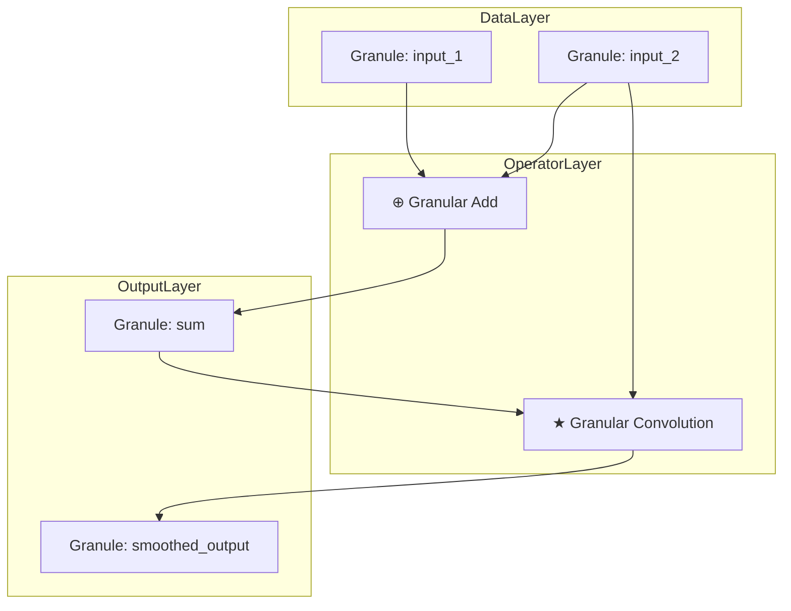

A new **granular arithmetic and algorithmic visualization framework** can be structured as a research-grade, GitHub-native architecture combining formal semantics, hierarchical operators, and visualization-first execution traces.[1][2]

***

## 1. The Formal Blueprint

### 1.1 Core Ontology

Define a *granule* as the atomic analytic unit for arithmetic and algorithms.

- **Granule**  
  A granule $$ g $$ is a typed, context-aware value:  
  $$
  g = (v, \tau, \kappa, \sigma)
  $$  
  where  
  $$\;v$$ is the raw payload (numeric, symbolic, structural),  
  $$\;\tau \in \mathcal{T}$$ is the static type,  
  $$\;\kappa \in \mathcal{K}$$ is the semantic tag set (e.g. “time-series:window=5”),  
  $$\;\sigma \in \Sigma$$ is the structural role (e.g. “node”, “edge”, “block”, “layer”).  

- **Granular Tensor**  
  A granular tensor is a multidimensional array of granules:  
  $$
  G \in \mathcal{G}^{d_1 \times \cdots \times d_n}
  $$  
  Each component $$G_{i_1,\dots,i_n} = g$$ carries its local semantics in $$(\tau,\kappa,\sigma)$$.

- **Granular Arithmetic Operator**  
  A granular operator is a partially defined map on compatible granules:  
  $$
  \odot : \mathcal{G}^m \rightarrow \mathcal{G}^k
  $$  
  with domain restricted by a *compatibility predicate*  
  $$
  C_{\odot}(g_1,\dots,g_m) \in \{0,1\}.
  $$

### 1.2 State Space and Workflow

A *Granular Workflow* is a directed acyclic hypergraph over operator applications.

- **Workflow Graph**  
  $$
  \mathcal{W} = (V,E)
  $$  
  where  
  $$V = \{ g_1,\dots,g_n \}$$ is the set of granules,  
  $$E = \{ (S_j, \odot_j, T_j)\}_{j=1}^M$$ is the set of operator hyper-edges with  
  $$S_j \subseteq V$$ as sources,  
  $$T_j \subseteq V$$ as targets,  
  $$\odot_j$$ a granular operator.

- **Execution State**  
  At time-step $$t$$, the system state is  
  $$
  \mathcal{S}_t = (\mathcal{W}, \rho_t)
  $$  
  where $$\rho_t: V \rightarrow \{\text{uncomputed}, \text{pending}, \text{ready}, \text{computed}, \text{failed}\}$$.

- **Objective Functional**  
  For an end-granule set $$V_{\text{out}} \subseteq V$$, define an objective  
  $$
  J(\mathcal{W}) = \Phi\left(\{v(g) \mid g \in V_{\text{out}}\}\right)
  $$  
  where $$\Phi$$ is task-specific (e.g. loss, utility, information gain).

### 1.3 Granular Arithmetic Semantics

Introduce *granular arithmetic* as arithmetic enriched with structural metadata.

- **Granular Addition**  
  For $$g_1=(v_1,\tau,\kappa,\sigma), g_2=(v_2,\tau,\kappa,\sigma)$$:  
  $$
  g_1 \oplus g_2 = (v_1 + v_2, \tau, \kappa \cup \kappa', \sigma)
  $$  
  only if $$C_{\oplus}(g_1,g_2)=1$$ which enforces type and structure compatibility.  

- **Granular Convolution**  
  A higher-order operator  
  $$
  \star: \mathcal{G}^{k \times n} \times \mathcal{G}^{m \times n} \rightarrow \mathcal{G}^{k \times m}
  $$  
  that performs a convolution over a shared axis (e.g. time), respecting semantic tags (e.g. windowing alignment).

### 1.4 Visualization-First Semantics

Every operator must admit an *explainable visualization morphism*.

- **Visualization Functor**  
  Define a functor  
  $$
  \mathcal{V}: \mathbf{GranFlow} \rightarrow \mathbf{Viz}
  $$  
  mapping workflows to visualization objects such that composition is preserved:  
  $$
  \mathcal{V}(e_2 \circ e_1) = \mathcal{V}(e_2) \circ \mathcal{V}(e_1).
  $$  
  This enforces that algorithmic composition has a consistent visual interpretation across scales.

***

## 2. The Integrated Logic

### 2.1 Domain Alignment

- From **abstract logic**, the framework models workflows as morphisms in a category whose objects are typed granules and whose arrows are granular operators, enabling compositional reasoning and equational refactoring without losing semantics.  
- From **computation**, the workflow graph is executable as a static dataflow graph or a dynamic computation graph, amenable to scheduling, parallelization, and incremental recomputation.  
- From **control and systems engineering**, the state evolution $$\mathcal{S}_t$$ and compatibility predicates $$C_{\odot}$$ act like guards and invariants in hybrid systems.  

### 2.2 Antifragility and Granularity

- Granularity introduces **localized failure** and **partial recomputation**: if one granule fails (e.g. due to input anomaly), only incident subgraphs require re-evaluation, improving robustness under perturbations.  
- Granular tags $$\kappa$$ enable **adaptive operators** that can route around degraded subspaces, analogous to fault-tolerant routing in distributed systems.[3][4]

### 2.3 Visualization as a First-Class Citizen

- The visualization functor $$\mathcal{V}$$ binds every algorithmic construct to a canonical representation (flow charts, sequence diagrams, layered architecture diagrams) using GitHub-compatible Mermaid syntax.[2][5]
- This makes the algorithm inherently inspectable: for any execution, the corresponding visualization is structurally guaranteed to exist and can be embedded directly in Markdown for review and audit.[6][1]

### 2.4 Information, Energy, and Logic

- **Information**: The framework treats granules as carriers of structured information, with operators acting as information transformers subject to compatibility constraints.  
- **Energy/Cost**: Each operator $$\odot$$ can be annotated with a cost model (e.g. time, memory, IO), yielding a resource-aware planning problem over $$\mathcal{W}$$.  
- **Logic**: Type and tag systems enforce logical invariants, preventing ill-typed compositions and ensuring that visually sensible workflows are also semantically well-formed.

***

## 3. The Executable Solution

Below is a GitHub-ready Markdown structure for an academic-style repository demonstrating this framework (with diagrams, pseudocode, and examples). GitHub supports fenced code blocks, LaTeX-like math (via rendered engines in many viewers), and Mermaid diagrams for architecture and flows.[5][1][2]

### 3.1 Repository Structure (Markdown)

```text
granular-arithmetic-framework/
├── README.md
├── docs/
│   ├── 01-introduction.md
│   ├── 02-formalism.md
│   ├── 03-architecture.md
│   ├── 04-algorithms.md
│   └── 05-experiments.md
├── src/
│   ├── core/
│   │   ├── granule.py
│   │   ├── operators.py
│   │   └── workflow.py
│   └── viz/
│       ├── mermaid_export.py
│       └── trace_renderer.py
└── examples/
    ├── time_series_smoothing.ipynb
    └── anomaly_detection.md
```

### 3.2 Core Python Skeleton (Executable Semantics)

```python
# src/core/granule.py
from __future__ import annotations
from dataclasses import dataclass, field
from typing import Any, Dict, FrozenSet, Literal


GranuleStatus = Literal["uncomputed", "pending", "ready", "computed", "failed"]


@dataclass(frozen=True)
class Granule:
    """
    Atomic analytic unit with semantic metadata.
    """
    value: Any
    gtype: str
    tags: FrozenSet[str] = field(default_factory=frozenset)
    role: str = "generic"

    def with_value(self, new_value: Any) -> "Granule":
        return Granule(
            value=new_value,
            gtype=self.gtype,
            tags=self.tags,
            role=self.role,
        )
```

```python
# src/core/operators.py
from __future__ import annotations
from dataclasses import dataclass
from typing import Callable, Iterable, List, Tuple
from .granule import Granule


CompatibilityFn = Callable[[Tuple[Granule, ...]], bool]
EvalFn = Callable[[Tuple[Granule, ...]], Tuple[Granule, ...]]


@dataclass
class GranularOperator:
    """
    Typed, compatibility-checked operator on granules.
    """
    name: str
    arity_in: int
    arity_out: int
    compatibility: CompatibilityFn
    evaluate: EvalFn
    cost_hint: float = 1.0  # abstract cost units

    def __call__(self, *inputs: Granule) -> Tuple[Granule, ...]:
        if len(inputs) != self.arity_in:
            raise ValueError(
                f"{self.name}: expected {self.arity_in} inputs, got {len(inputs)}"
            )
        if not self.compatibility(inputs):
            raise TypeError(f"{self.name}: incompatible inputs {inputs}")
        return self.evaluate(inputs)
```

```python
# src/core/workflow.py
from __future__ import annotations
from dataclasses import dataclass, field
from typing import Dict, List, Set, Tuple
from .granule import Granule, GranuleStatus
from .operators import GranularOperator


@dataclass
class NodeState:
    granule: Granule
    status: GranuleStatus = "uncomputed"


@dataclass
class Edge:
    sources: Tuple[str, ...]
    targets: Tuple[str, ...]
    operator: GranularOperator


@dataclass
class GranularWorkflow:
    """
    Directed acyclic hypergraph over granules and operators.
    """
    nodes: Dict[str, NodeState] = field(default_factory=dict)
    edges: List[Edge] = field(default_factory=list)

    def add_granule(self, name: str, granule: Granule) -> None:
        if name in self.nodes:
            raise KeyError(f"Granule {name} already exists")
        self.nodes[name] = NodeState(granule=granule)

    def add_edge(
        self,
        sources: Tuple[str, ...],
        targets: Tuple[str, ...],
        operator: GranularOperator,
    ) -> None:
        self.edges.append(Edge(sources=sources, targets=targets, operator=operator))

    def topological_sort(self) -> List[Edge]:
        # Simple Kahn-style topological ordering on hyper-edges
        indegree: Dict[str, int] = {n: 0 for n in self.nodes}
        for e in self.edges:
            for t in e.targets:
                indegree[t] += 1
        queue: List[str] = [n for n, d in indegree.items() if d == 0]
        ordered_edges: List[Edge] = []

        # Map from node to outgoing edges
        outgoing: Dict[str, List[Edge]] = {n: [] for n in self.nodes}
        for e in self.edges:
            for s in e.sources:
                outgoing[s].append(e)

        visited: Set[Edge] = set()
        while queue:
            current = queue.pop()
            for e in outgoing[current]:
                if e in visited:
                    continue
                visited.add(e)
                ordered_edges.append(e)
                for t in e.targets:
                    indegree[t] -= 1
                    if indegree[t] == 0:
                        queue.append(t)
        if len(ordered_edges) != len(self.edges):
            raise ValueError("Workflow contains cycles or disconnected components")
        return ordered_edges

    def execute(self) -> None:
        for edge in self.topological_sort():
            input_nodes = [self.nodes[n] for n in edge.sources]
            for n in input_nodes:
                if n.status != "computed":
                    raise RuntimeError(
                        f"Input {n} not computed before edge {edge.operator.name}"
                    )
            inputs = tuple(n.granule for n in input_nodes)
            outputs = edge.operator(*inputs)
            if len(outputs) != len(edge.targets):
                raise RuntimeError(
                    f"{edge.operator.name}: expected {len(edge.targets)} outputs, "
                    f"got {len(outputs)}"
                )
            for name, granule in zip(edge.targets, outputs):
                self.nodes[name] = NodeState(granule=granule, status="computed")
```

### 3.3 Pseudocode for Granular Workflow Execution

```text
Algorithm ExecuteGranularWorkflow(Workflow W):
    Input: W = (V, E) with granules V and edges E
    Output: Updated states for all v ∈ V

    1: order ← TopologicalSortHyperEdges(E)
    2: for each edge e in order do
    3:     (S, op, T) ← e
    4:     if ∃ s ∈ S such that state[s] ≠ computed then
    5:         raise ExecutionError("Uncomputed dependency")
    6:     inputs  ← [value[s] for s in S]
    7:     if not op.compatibility(inputs) then
    8:         mark all t ∈ T as failed
    9:         continue
   10:     outputs ← op.evaluate(inputs)
   11:     if |outputs| ≠ |T| then
   12:         raise ExecutionError("Arity mismatch")
   13:     for i from 1 to |T| do
   14:         value[T[i]] ← outputs[i]
   15:         state[T[i]] ← computed
   16: return (value, state)
```

### 3.4 Mermaid Architecture Diagram (GitHub-Compatible)



### 3.5 Example: Time-Series Smoothing Workflow

- Inputs: noisy time-series $$x_t$$ as granules $$\{g_t\}$$ tagged with `time:t`.  
- Operator: sliding-window mean as granular convolution.  
- Output: smoothed series granules $$\{\tilde{g}_t\}$$ with updated tags `time:t, op:smooth(window=5)`.

```python
from typing import Tuple
from src.core.granule import Granule
from src.core.operators import GranularOperator


def mean_compatibility(inputs: Tuple[Granule, ...]) -> bool:
    # All inputs must share gtype and time-series tag
    gtypes = {g.gtype for g in inputs}
    if len(gtypes) != 1:
        return False
    return all("time-series" in g.tags for g in inputs)


def mean_evaluate(inputs: Tuple[Granule, ...]) -> Tuple[Granule, ...]:
    values = [g.value for g in inputs]
    avg = sum(values) / len(values)
    base = inputs[0]
    new_tags = set(base.tags) | {"op:smooth(window=5)"}
    return (
        Granule(
            value=avg,
            gtype=base.gtype,
            tags=frozenset(new_tags),
            role=base.role,
        ),
    )


Mean5 = GranularOperator(
    name="Mean5",
    arity_in=5,
    arity_out=1,
    compatibility=mean_compatibility,
    evaluate=mean_evaluate,
    cost_hint=5.0,
)
```

***

## 4. Holistic Oversight & Second-Order Effects

### 4.1 Safety, Bias, and Inspectability

- The explicit typing and tagging of granules, plus compatibility predicates, adds a **contract layer** that can encode safety policies (e.g. “no PII granule may exit to external sinks”), making misuse detection a matter of static or dynamic checks.  
- Visualization-first design means *all* workflows can be rendered as human-auditable diagrams in Markdown, reducing the opacity of complex pipelines and improving review quality.[7][3][2]

### 4.2 Complexity, Cost, and Scalability

- The hypergraph representation allows cost-aware scheduling and parallelization (e.g. mapping independent subgraphs to separate executors), but it also introduces overhead for very simple tasks where monolithic arithmetic would suffice.  
- To manage complexity, one can introduce *granular macros* that collapse frequently used subgraphs into higher-level operators, preserving the underlying structure for visualization while offering simplified views at higher abstraction levels.[4][7]

### 4.3 Ethical and Long-Term Considerations

- By construction, the framework promotes **explainability** and **traceability**, directly addressing common failure modes in opaque algorithmic systems (e.g. silent data drift, untracked feature coupling).  
- Long-term, this architecture can be generalized to support **cross-team architectural documents** and **design-as-code** workflows, using the same graph and visualization infrastructure to align technical, organizational, and ethical constraints in a single, inspectable space.[3][2]

Sources
[1] Basic writing and formatting syntax - GitHub Docs https://docs.github.com/github/writing-on-github/getting-started-with-writing-and-formatting-on-github/basic-writing-and-formatting-syntax
[2] Include diagrams in your Markdown files with Mermaid https://github.blog/developer-skills/github/include-diagrams-markdown-files-mermaid/
[3] Architecture Design Workflow - The GitLab Handbook https://handbook.gitlab.com/handbook/engineering/architecture/workflow/
[4] Software Architecture Guide - Martin Fowler https://martinfowler.com/architecture/
[5] Creating Mermaid diagrams - GitHub Docs https://docs.github.com/en/get-started/writing-on-github/working-with-advanced-formatting/creating-diagrams
[6] Extended Syntax - Markdown Guide https://www.markdownguide.org/extended-syntax/
[7] System architecture diagram basics & best practices - vFunction https://vfunction.com/blog/architecture-diagram-guide/
[8] How to make GitHub Pages Markdown support mermaid diagram? https://stackoverflow.com/questions/53883747/how-to-make-github-pages-markdown-support-mermaid-diagram
[9] render-md-mermaid · Actions · GitHub Marketplace https://github.com/marketplace/actions/render-md-mermaid
[10] I created a GitHub Repo which contains (pseudocode) of various ... https://www.reddit.com/r/learnprogramming/comments/dfig40/i_created_a_github_repo_which_contains_pseudocode/
