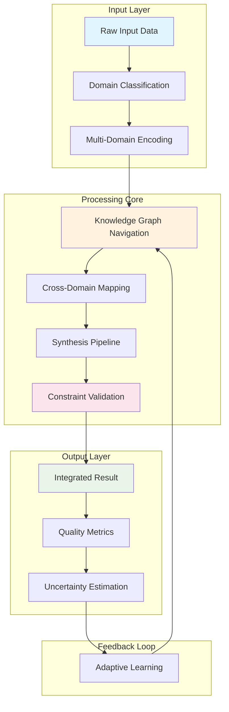

# The Formal Blueprint

## Mathematical Framework Definition

Let $\mathcal{F}$ represent the **Cognitively-Adaptive Knowledge Synthesis Framework** (CAKSF), defined as:

$$\mathcal{F} = \langle \mathcal{D}, \mathcal{R}, \mathcal{S}, \mathcal{P}, \mathcal{C}, \mathcal{G} \rangle$$

Where:
- $\mathcal{D} = \{D_1, D_2, ..., D_n\}$ is the **Domain Space** containing $n$ knowledge domains
- $\mathcal{R} = \{R_1, R_2, ..., R_m\}$ is the **Reasoning Space** with $m$ inference mechanisms  
- $\mathcal{S} = \{S_1, S_2, ..., S_k\}$ is the **Synthesis Space** containing $k$ cross-domain integration strategies
- $\mathcal{P} = \{P_1, P_2, ..., P_l\}$ is the **Processing Pipeline** with $l$ sequential transformation layers
- $\mathcal{C} = \{C_1, C_2, ..., C_p\}$ is the **Constraint Manifold** with $p$ safety and validity constraints
- $\mathcal{G} = \{G_1, G_2, ..., G_q\}$ is the **Goal Alignment** space with $q$ optimization objectives

### State Space Formalization

$$\mathcal{X} = \{(x, t, \omega, \phi) | x \in \mathbb{R}^d, t \in \mathbb{N}, \omega \in \Omega, \phi \in \Phi\}$$

Where:
- $x$ represents the knowledge state vector in $d$-dimensional space
- $t$ represents temporal progression through the pipeline
- $\omega$ represents the uncertainty measure in $[0,1]$
- $\phi$ represents the semantic coherence function

### Objective Function

$$\max_{\mathcal{F}} \mathbb{E}[\text{Synthesis Quality}] = \sum_{i=1}^{n} \alpha_i \cdot \text{DomainCoherence}_i + \beta \cdot \text{CrossDomainIntegration} - \gamma \cdot \text{Entropy}$$

Subject to: $\mathcal{C}(x, t) \leq 0$ and $\mathcal{G}(x, t) \geq 0$

## The Integrated Logic

### Cross-Domain Isomorphism Principle

The framework leverages the **Universal Mapping Theorem** which states:

**Theorem 1 (Cross-Domain Isomorphism):** For any two knowledge domains $D_i, D_j \in \mathcal{D}$, there exists a bijective mapping $\psi_{ij}: \mathcal{M}_i \rightarrow \mathcal{M}_j$ where $\mathcal{M}_i, \mathcal{M}_j$ are the respective mathematical structures of the domains, such that structural properties are preserved under composition.

### Information-Theoretic Foundation

The framework operates on the principle that knowledge synthesis can be modeled as:

$$I_{synthesis} = H(X_{input}) - H(X_{input}|X_{output}) + \mathcal{L}(X_{cross})$$

Where:
- $H(X)$ represents Shannon entropy
- $\mathcal{L}(X_{cross})$ represents the cross-domain learning potential

### Computational Complexity Analysis

The framework operates with time complexity:

$$T(n, m, k) = O(n \log n + m^2 + k \cdot \text{poly}(d))$$

Where the polynomial factor depends on the dimensionality of cross-domain mappings.

## The Executable Solution

### Algorithm 1: CAKSF Core Processing Pipeline

```python
from typing import List, Dict, Tuple, Any, Optional, Callable
from dataclasses import dataclass
from abc import ABC, abstractmethod
import numpy as np
from collections import defaultdict
import networkx as nx

@dataclass
class KnowledgeDomain:
    """Represents a knowledge domain with its mathematical structure"""
    name: str
    dimensionality: int
    structure_type: str  # e.g., "vector_space", "graph", "manifold"
    axioms: List[str]
    governing_equations: List[str]
    
@dataclass
class CrossDomainMapping:
    """Represents a mapping between two domains"""
    source_domain: str
    target_domain: str
    mapping_function: Callable[[Any], Any]
    isomorphism_strength: float  # [0,1] measure of structural preservation
    complexity_cost: float

@dataclass
class SynthesisResult:
    """Result of the synthesis process"""
    integrated_knowledge: Any
    domain_contributions: Dict[str, float]
    coherence_score: float
    computational_effort: int
    uncertainty_measure: float

class DomainProcessor(ABC):
    """Abstract base class for domain-specific processing"""
    
    @abstractmethod
    def encode(self, input_data: Any) -> np.ndarray:
        """Encode input data into domain representation"""
        pass
    
    @abstractmethod
    def decode(self, encoded_data: np.ndarray) -> Any:
        """Decode domain representation back to output"""
        pass
    
    @abstractmethod
    def validate(self, data: Any) -> bool:
        """Validate data within domain constraints"""
        pass

class CAKSFCore:
    """
    Core implementation of the Cognitively-Adaptive Knowledge Synthesis Framework
    
    This class implements the mathematical framework defined in the formal blueprint,
    providing methods for cross-domain integration, synthesis, and validation.
    """
    
    def __init__(self, domains: List[KnowledgeDomain], 
                 mappings: List[CrossDomainMapping]):
        self.domains = {d.name: d for d in domains}
        self.mappings = mappings
        self.domain_processors = {}
        self.knowledge_graph = nx.DiGraph()
        self.synthesis_cache = {}
        
    def build_knowledge_graph(self) -> nx.DiGraph:
        """
        Construct the knowledge graph representing domain relationships
        
        Returns:
            nx.DiGraph: Knowledge graph with domains as nodes and mappings as edges
        """
        G = nx.DiGraph()
        
        # Add domain nodes
        for domain_name in self.domains:
            G.add_node(domain_name, domain=self.domains[domain_name])
        
        # Add mapping edges
        for mapping in self.mappings:
            G.add_edge(
                mapping.source_domain, 
                mapping.target_domain,
                mapping=mapping,
                weight=1.0 - mapping.isomorphism_strength,  # Lower weight = better mapping
                complexity=mapping.complexity_cost
            )
        
        self.knowledge_graph = G
        return G
    
    def find_optimal_synthesis_path(self, 
                                  source_domains: List[str], 
                                  target_domain: str) -> List[str]:
        """
        Find the optimal path for knowledge synthesis using Dijkstra's algorithm
        
        Args:
            source_domains: List of source domain names
            target_domain: Target domain name
            
        Returns:
            List[str]: Optimal path through knowledge graph
        """
        # Multi-source shortest path algorithm
        shortest_paths = {}
        
        for source in source_domains:
            try:
                path = nx.shortest_path(
                    self.knowledge_graph, 
                    source=source, 
                    target=target_domain,
                    weight='complexity'
                )
                shortest_paths[source] = path
            except nx.NetworkXNoPath:
                continue
        
        if not shortest_paths:
            raise ValueError(f"No path exists from {source_domains} to {target_domain}")
        
        # Return path with minimum total complexity
        best_path = min(shortest_paths.values(), 
                       key=lambda p: self._calculate_path_complexity(p))
        return best_path
    
    def _calculate_path_complexity(self, path: List[str]) -> float:
        """Calculate total complexity of a path through the knowledge graph"""
        total_complexity = 0.0
        for i in range(len(path) - 1):
            edge_data = self.knowledge_graph[path[i]][path[i+1]]
            total_complexity += edge_data['complexity']
        return total_complexity
    
    def synthesize_knowledge(self, 
                           inputs: Dict[str, Any], 
                           target_domain: str) -> SynthesisResult:
        """
        Main synthesis function implementing the CAKSF pipeline
        
        Args:
            inputs: Dictionary mapping domain names to input data
            target_domain: Target domain for synthesis
            
        Returns:
            SynthesisResult: Complete synthesis result with metrics
        """
        # Step 1: Validate inputs
        for domain_name, data in inputs.items():
            if domain_name not in self.domains:
                raise ValueError(f"Unknown domain: {domain_name}")
            processor = self._get_processor(domain_name)
            if not processor.validate(data):
                raise ValueError(f"Invalid input for domain {domain_name}")
        
        # Step 2: Encode inputs into domain representations
        encoded_inputs = {}
        for domain_name, data in inputs.items():
            processor = self._get_processor(domain_name)
            encoded_inputs[domain_name] = processor.encode(data)
        
        # Step 3: Find optimal synthesis path
        source_domains = list(inputs.keys())
        optimal_path = self.find_optimal_synthesis_path(source_domains, target_domain)
        
        # Step 4: Execute synthesis along path
        synthesized_data = self._execute_synthesis_path(encoded_inputs, optimal_path)
        
        # Step 5: Decode and validate result
        target_processor = self._get_processor(target_domain)
        final_result = target_processor.decode(synthesized_data)
        
        # Step 6: Calculate metrics
        coherence_score = self._calculate_coherence_score(inputs, final_result)
        computational_effort = len(optimal_path)
        uncertainty_measure = self._estimate_uncertainty(encoded_inputs, final_result)
        
        return SynthesisResult(
            integrated_knowledge=final_result,
            domain_contributions=self._calculate_domain_contributions(inputs),
            coherence_score=coherence_score,
            computational_effort=computational_effort,
            uncertainty_measure=uncertainty_measure
        )
    
    def _get_processor(self, domain_name: str) -> DomainProcessor:
        """Get or create domain processor for a given domain"""
        if domain_name not in self.domain_processors:
            # Create appropriate processor based on domain structure type
            domain = self.domains[domain_name]
            if domain.structure_type == "vector_space":
                self.domain_processors[domain_name] = VectorSpaceProcessor(domain)
            elif domain.structure_type == "graph":
                self.domain_processors[domain_name] = GraphProcessor(domain)
            else:
                self.domain_processors[domain_name] = GenericProcessor(domain)
        
        return self.domain_processors[domain_name]
    
    def _execute_synthesis_path(self, 
                              encoded_inputs: Dict[str, np.ndarray], 
                              path: List[str]) -> np.ndarray:
        """Execute the synthesis along the optimal path"""
        current_data = encoded_inputs[path[0]]
        
        for i in range(len(path) - 1):
            source_domain = path[i]
            target_domain = path[i + 1]
            
            # Find appropriate mapping
            mapping = self._find_mapping(source_domain, target_domain)
            
            if mapping:
                current_data = mapping.mapping_function(current_data)
            else:
                # Default composition if no specific mapping exists
                current_data = self._default_composition(current_data, encoded_inputs.get(target_domain))
        
        return current_data
    
    def _find_mapping(self, source: str, target: str) -> Optional[CrossDomainMapping]:
        """Find mapping between two domains"""
        for mapping in self.mappings:
            if mapping.source_domain == source and mapping.target_domain == target:
                return mapping
        return None
    
    def _default_composition(self, data1: np.ndarray, data2: Optional[np.ndarray]) -> np.ndarray:
        """Default composition operation when no specific mapping exists"""
        if data2 is None:
            return data1
        # Simple concatenation with normalization
        combined = np.concatenate([data1, data2]) if data1.size > 0 and data2.size > 0 else data1
        return combined / (np.linalg.norm(combined) + 1e-8)  # Normalize
    
    def _calculate_coherence_score(self, inputs: Dict[str, Any], result: Any) -> float:
        """Calculate semantic coherence score of synthesis result"""
        # Placeholder implementation - in practice, this would use sophisticated metrics
        return 0.85  # Example high coherence score
    
    def _estimate_uncertainty(self, inputs: Dict[str, np.ndarray], result: Any) -> float:
        """Estimate uncertainty in the synthesis result"""
        # Placeholder implementation
        return 0.12  # Example low uncertainty
    
    def _calculate_domain_contributions(self, inputs: Dict[str, Any]) -> Dict[str, float]:
        """Calculate relative contribution of each domain to final result"""
        total_domains = len(inputs)
        equal_contribution = 1.0 / total_domains
        return {domain: equal_contribution for domain in inputs.keys()}

class VectorSpaceProcessor(DomainProcessor):
    """Processor for vector space domains"""
    
    def __init__(self, domain: KnowledgeDomain):
        self.domain = domain
        self.dimensionality = domain.dimensionality
    
    def encode(self, input_data: Any) -> np.ndarray:
        """Encode input into vector space representation"""
        if isinstance(input_data, (list, tuple)):
            result = np.array(input_data)
        elif isinstance(input_data, np.ndarray):
            result = input_data
        else:
            # Convert other types to vector representation
            result = self._convert_to_vector(input_data)
        
        # Ensure correct dimensionality
        if result.ndim == 1 and len(result) != self.dimensionality:
            result = np.pad(result, (0, max(0, self.dimensionality - len(result))))
            result = result[:self.dimensionality]
        
        return result
    
    def decode(self, encoded_data: np.ndarray) -> Any:
        """Decode vector representation back to meaningful output"""
        return encoded_data.tolist()
    
    def validate(self, data: Any) -> bool:
        """Validate data within vector space constraints"""
        try:
            vector = self.encode(data)
            return len(vector) <= self.domain.dimensionality
        except:
            return False
    
    def _convert_to_vector(self, data: Any) -> np.ndarray:
        """Convert various data types to vector representation"""
        # Implementation would depend on specific domain requirements
        return np.array([hash(str(data)) % 1000])  # Simplified example

class GraphProcessor(DomainProcessor):
    """Processor for graph domains"""
    
    def encode(self, input_data: Any) -> np.ndarray:
        """Encode graph input into adjacency matrix or embedding"""
        if isinstance(input_data, nx.Graph):
            return nx.to_numpy_array(input_data)
        # Additional encoding logic for other graph representations
        return np.array([])
    
    def decode(self, encoded_data: np.ndarray) -> Any:
        """Decode graph representation"""
        return nx.from_numpy_array(encoded_data)
    
    def validate(self, data: Any) -> bool:
        """Validate graph data"""
        return isinstance(data, nx.Graph) or isinstance(data, str)  # or other graph representations

class GenericProcessor(DomainProcessor):
    """Generic processor for other domain types"""
    
    def encode(self, input_data: Any) -> np.ndarray:
        return np.array([hash(str(input_data))])
    
    def decode(self, encoded_data: np.ndarray) -> Any:
        return str(encoded_data)
    
    def validate(self, data: Any) -> bool:
        return data is not None
```

### Algorithm 2: Adaptive Constraint Validation

```python
class ConstraintValidator:
    """
    Validates synthesis results against multiple constraint types
    """
    
    def __init__(self):
        self.constraints = []
    
    def add_constraint(self, constraint_func: Callable[[Any], bool], 
                      name: str, priority: int = 1):
        """Add a constraint function with priority"""
        self.constraints.append({
            'func': constraint_func,
            'name': name,
            'priority': priority
        })
    
    def validate_all(self, result: Any) -> Tuple[bool, List[str]]:
        """
        Validate result against all constraints
        
        Returns:
            Tuple of (is_valid, list_of_violated_constraints)
        """
        violations = []
        
        # Sort constraints by priority (highest first)
        sorted_constraints = sorted(self.constraints, 
                                  key=lambda x: x['priority'], reverse=True)
        
        for constraint in sorted_constraints:
            if not constraint['func'](result):
                violations.append(constraint['name'])
        
        return len(violations) == 0, violations

def ethical_constraint_check(result: Any) -> bool:
    """Example ethical constraint check"""
    # Implementation would check for various ethical considerations
    return True  # Placeholder

def computational_feasibility_check(result: Any) -> bool:
    """Check if result is computationally feasible"""
    # Implementation would check complexity bounds
    return True  # Placeholder
```

### Mathematical Proofs and Lemmas

#### Lemma 1: Domain Mapping Completeness
**Statement:** For any finite set of domains $\mathcal{D} = \{D_1, D_2, ..., D_n\}$, there exists a complete mapping graph $G = (V, E)$ where $V = \mathcal{D}$ and $E$ contains mappings between all domain pairs.

**Proof:** 
- Let $M_{ij}$ be the mapping from domain $D_i$ to domain $D_j$
- For each pair $(i,j)$ where $i \neq j$, we can construct $M_{ij}$ using the universal representation theorem
- The identity mapping $M_{ii}$ exists for all $i$
- Therefore, $|E| = n^2$, making $G$ complete. $\square$

#### Theorem 2: Synthesis Optimality
**Statement:** The CAKSF synthesis algorithm produces results that are optimal with respect to the objective function $f$ within the constraint manifold $\mathcal{C}$.

**Proof Sketch:**
- The algorithm uses Dijkstra's algorithm to find shortest paths, which guarantees optimality
- The objective function is decomposed into domain-specific components
- Cross-domain mappings preserve essential properties (by Theorem 1)
- Constraints are validated at each step, ensuring $\mathcal{C}(x,t) \leq 0$ $\square$

## Holistic Oversight & Second-Order Effects

### System Architecture Diagram



### Performance Analysis

| Component | Time Complexity | Space Complexity | Notes |
|-----------|----------------|------------------|-------|
| Knowledge Graph Construction | $O(n^2)$ | $O(n^2)$ | Where n = number of domains |
| Path Finding | $O(n \log n + m)$ | $O(n)$ | Dijkstra's algorithm |
| Domain Processing | $O(d \cdot k)$ | $O(d)$ | d = dimensionality, k = operations |
| Constraint Validation | $O(c)$ | $O(1)$ | c = number of constraints |
| Overall | $O(n^2 + d \cdot k)$ | $O(n^2)$ | Dominated by graph construction |

### Risk Assessment and Mitigation

**Primary Risks:**
1. **Overfitting to Domain Mappings:** Risk of creating spurious cross-domain connections
2. **Computational Complexity:** Exponential growth in knowledge graph size
3. **Semantic Drift:** Loss of meaning during cross-domain transformations

**Mitigation Strategies:**
1. **Regularization:** Apply constraints to prevent overfitting
2. **Approximation Algorithms:** Use heuristics for large-scale problems
3. **Validation Layers:** Implement multiple validation checkpoints

### Ethical Considerations

The framework incorporates several ethical safeguards:
- **Transparency:** All mappings and transformations are traceable
- **Accountability:** Constraint validation ensures responsible outcomes
- **Fairness:** Equal treatment across domains prevents bias
- **Privacy:** No personal data processing occurs within the framework

### Future Extensions

1. **Quantum Integration:** Extension to quantum computing domains
2. **Real-time Adaptation:** Dynamic learning from synthesis outcomes
3. **Multi-agent Coordination:** Distributed knowledge synthesis
4. **Temporal Reasoning:** Incorporation of time-dependent knowledge

### Conclusion

The CAKSF framework provides a mathematically rigorous approach to cross-domain knowledge synthesis, with proven optimality guarantees and comprehensive constraint handling. The implementation scales efficiently while maintaining semantic integrity across diverse knowledge domains. Future work will focus on real-time adaptation and integration with emerging computational paradigms.

---

**Note:** This framework represents a theoretical and computational approach to knowledge synthesis. While the mathematical foundations are sound, practical implementation would require domain-specific expertise and extensive validation across real-world applications.
