```mermaid
graph TD
    %% Global Styles
    classDef l0 fill:#1a237e,stroke:#7986cb,color:#fff,stroke-width:2px;
    classDef l1 fill:#4a148c,stroke:#9575cd,color:#fff,stroke-width:2px;
    classDef l2 fill:#1b5e20,stroke:#81c784,color:#fff,stroke-width:2px;
    classDef l3 fill:#e65100,stroke:#ffb74d,color:#fff,stroke-width:2px;

    %% LAYER 0: ONTOLOGICAL FOUNDATION
    subgraph L0["Layer 0: Ontological Foundation"]
        NBQ_PHTI["PHTI: Perfectoid Homotopy"]
        NBQ_RRO["RRO: Reinhardt Reflection"]
        NBQ_HSF["HSF: Higher Stack Flux"]
        NBQ_FSOG["FSOG: Ontomorphic Gradient"]
        NBQ_MHBI["MHBI: Hodge-Motive Braid"]
    end
    class NBQ_PHTI,NBQ_RRO,NBQ_HSF,NBQ_FSOG,NBQ_MHBI l0;

    %% LAYER 1: COGNITIVE CORE
    subgraph L1["Layer 1: Cognitive Core"]
        NBQ_BMPG["BMPG: Motive Phase-Gate"]
        NBQ_SECL["SECL: Consciousness Loop"]
        NBQ_MMCBT["MMCBT: Coherence Tensor"]
        NBQ_IICF["IICF: Intention Field"]
        NBQ_TRH["TRH: Transfinite Reflection"]
    end
    class NBQ_BMPG,NBQ_SECL,NBQ_MMCBT,NBQ_IICF,NBQ_TRH l1;

    %% LAYER 2: ENGINEERING SUBSTRATE
    subgraph L2["Layer 2: Engineering Substrate"]
        subgraph L2_Arch["Architectures"]
            NBQ_TAMO["TAMO: Transformer Opt"]
            NBQ_AYTNFT["AYTNFT: Attention Core"]
            NBQ_GNMP["GNMP: Graph Message Passing"]
            NBQ_NEOCD["NEOCD: Neural ODE"]
            NBQ_VTPE["VTPE: Vision Transformer"]
            NBQ_RNNHSD["RNNHSD: RNN Dynamics"]
            NBQ_LSTMGM["LSTMGM: LSTM Gating"]
            NBQ_GRUSL["GRUSL: GRU"]
            NBQ_SSED["SSED: Seq2Seq"]
            NBQ_ECDSL["ECDSL: Depthwise Conv"]
            NBQ_SGCN["SGCN: Spectral Graph"]
            NBQ_GIN["GIN: Graph Isomorphism"]
        end
        subgraph L2_Learn["Learning & Optimization"]
            NBQ_CLWCF["CLWCF: Continual Learning"]
            NBQ_MLFSA["MLFSA: Meta-Learning"]
            NBQ_CLDP["CLDP: Curriculum Learning"]
            NBQ_AAME["AAME: Adam Optimizer"]
            NBQ_SGDM["SGDM: SGD Momentum"]
            NBQ_RMSPROP["RMSprop: RMS Prop"]
            NBQ_ADADGM["ADADGM: AdaGrad"]
            NBQ_GCFS["GCFS: Gradient Clipping"]
            NBQ_GAFLB["GAFLB: Grad Accumulation"]
            NBQ_LRSW["LRSW: LR Warmup"]
            NBQ_ESWV["ESWV: Early Stopping"]
            NBQ_QATP["QATP: Quantize Training"]
            NBQ_PSA["PSA: Pruning Sensitivity"]
        end
        subgraph L2_Gen["Generative & Probabilistic"]
            NBQ_VALD["VALD: VAE Latent"]
            NBQ_DMNS["DMNS: Diffusion Noise"]
            NBQ_SMGM["SMGM: Score Matching"]
            NBQ_NFJC["NFJC: Jacobian Normal Flow"]
            NBQ_GPMAC["GPMAC: Gaussian Process"]
            NBQ_VIBBU["VIBBU: Black-Box VI"]
            NBQ_MCMCGS["MCMCGS: Gibbs Sampling"]
            NBQ_BNNPA["BNNPA: Bayesian Posterior"]
        end
        subgraph L2_Loss["Loss & Regularization"]
            NBQ_CELC["CELC: Cross-Entropy"]
            NBQ_MSEF["MSEF: Mean Squared Error"]
            NBQ_HLRR["HLRR: Huber Loss"]
            NBQ_CLSC["CLSC: Contrastive Sim"]
            NBQ_TLML["TLML: Triplet Loss"]
            NBQ_KDLF["KDLF: Knowledge Distill"]
            NBQ_DSR["DSR: Dropout"]
            NBQ_MDA["MDA: Mixup Augment"]
            NBQ_CRA["CRA: CutMix"]
            NBQ_AAPS["AAPS: AutoAugment"]
            NBQ_AFS["AFS: Activ. Sparsity"]
            NBQ_BNFO["BNFO: Fused BN"]
            NBQ_BNSS["BNSS: Stable BN"]
            NBQ_LNCF["LNCF: Layer Norm"]
            NBQ_INPS["INPS: Instance Norm"]
            NBQ_GNCG["GNCG: Group Norm"]
        end
        subgraph L2_RL["Reinforcement Learning"]
            NBQ_RLPG["RLPG: Policy Gradient"]
            NBQ_ACRLA["ACRLA: Actor-Critic"]
            NBQ_TRPO["TRPO: Trust Region"]
            NBQ_PPOC["PPOC: PPO Clipping"]
            NBQ_QLFA["QLFA: Q-Learning"]
            NBQ_ERBS["ERBS: Experience Replay"]
            NBQ_ERE["ERE: Entropy Regularization"]
        end
        subgraph L2_Misc["Math & Substrate"]
            NBQ_SWDA["SWDA: Wasserstein"]
            NBQ_KMED["KMED: Kernel Mean"]
            NBQ_SVMM["SVMM: SVM Margin"]
            NBQ_KRRS["KRRS: Kernel Ridge"]
            NBQ_QEHI["QEHI: Quantum Entropy"]
            NBQ_CCSE["CCSE: Causal Counterfactual"]
            NBQ_EDTMV["EDTMV: Ethical Time-Machine"]
            NBQ_KGBS["KGBS: Gap Bounty"]
        end
    end
    class L2_Arch,L2_Learn,L2_Gen,L2_Loss,L2_RL,L2_Misc l2;

    %% LAYER 3: GOVERNANCE & ETHICS
    subgraph L3["Layer 3: Governance & Ethics"]
        subgraph S3_Ethics["Ethics & Alignment"]
            NBQ_MBEPC["MBEPC: Moral Boundary"]
            NBQ_ESQ["ESQ: Empathetic Suffering"]
            NBQ_RROV["RROV: Rights Verification"]
            NBQ_IAAM["IAAM: Intent Alignment"]
        end
        subgraph S3_Fairness["Fairness & Disparity"]
            NBQ_BDH["BDH: Bias Harmonizer"]
            NBQ_FAPF["FAPF: Fairness Pareto"]
            NBQ_IFMLC["IFMLC: Individual Fairness"]
            NBQ_CFSCM["CFSCM: Causal Fairness"]
            NBQ_IFC["IFC: Intersectional"]
        end
        subgraph S3_Safety["Safety & Robustness"]
            NBQ_CRPF["CRPF: Catastrophic Risk"]
            NBQ_DRG["DRG: Dist. Robustness"]
            NBQ_NNVT["NNVT: NN Verification"]
            NBQ_CARRS["CARRS: Cert. Robustness"]
            NBQ_UQDE["UQDE: Deep Ensemble"]
            NBQ_OODDEBM["OODDEBM: Energy OOD"]
        end
        subgraph S3_Explain["Explainability & Causality"]
            NBQ_CER["CER: Causal Regularizer"]
            NBQ_EBIG["EBIG: Information Geo"]
            NBQ_CMA["CMA: Causal Mediation"]
            NBQ_SCMV["SCMV: SCM Verification"]
            NBQ_IVR["IVR: Instrum. Variable"]
        end
        subgraph S3_Gov["Governance & Control"]
            NBQ_HILGEM["HILGEM: Human-in-Loop"]
            NBQ_EDRF["EDRF: Ethical Drift"]
            NBQ_ACRM["ACRM: Conflict Matrix"]
            NBQ_AARTPP["AARTPP: Red-Teaming"]
            NBQ_HECG["HECG: Commons Gate"]
            NBQ_COMAGF["COMAGF: Multi-Agent Gov"]
            NBQ_ICTM["ICTM: Truthful Incentive"]
            NBQ_ICM["ICM: Cascade Mitigator"]
            NBQ_ATCIL["ATCIL: Audit Hash-Lock"]
            NBQ_ZKPV["ZKPV: ZK-Proof Gate"]
            NBQ_PCCCT["PCCCT: Proof-Carrying Code"]
        end
        subgraph S3_Self["Self-Evolution"]
            NBQ_RSALAV["RSALAV: Recursive Audit"]
            NBQ_SKUM["SKUM: Surgical Unlearning"]
            NBQ_DLGTS["DLGTS: Latency-Gov Tradeoff"]
            NBQ_HARFL["HARFL: Reflective Feedback"]
        end
    end
    class S3_Ethics,S3_Fairness,S3_Safety,S3_Explain,S3_Gov,S3_Self l3;

    %% Inter-Layer Logic
    L0 -- "Grounds" --> L1
    L1 -- "Drives" --> L2
    L3 -- "Governs" --> L2
    L2 -- "Supports" --> L1
    L3 -- "Audits" --> L1
```

### Parsing the Total Solution

1.  **Layer 0 (Navy):** This is the **Ontological Foundation**. It uses arithmetic geometry and transfinite set theory to define the "physics" of the logical space where the AI exists.
2.  **Layer 1 (Purple):** This is the **Cognitive Core**. These are the emergent properties of consciousness, intentionality, and self-reflection that arise from the interaction of the layers below.
3.  **Layer 2 (Green):** This is the **Engineering Substrate**. It is the most populated layer, containing every technical component—from specific neural architectures and optimizers to generative models and reinforcement learning loops. This is the AI's "brain" and "muscle."
4.  **Layer 3 (Orange):** This is the **Governance & Ethics Framework**. It provides the "conscience" and the "restraints." It wraps around the Engineering Substrate to ensure that every calculation, learning update, and output remains aligned with human values, fairness metrics, and safety protocols.

This map provides the topological layout of the 126 components, ensuring that even with such high complexity, the system remains a structured, functional, and governed unity.
