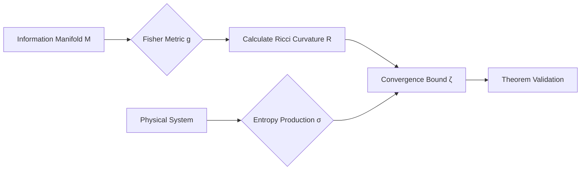

---

### 1. The Formal Blueprint: The Information-Geometric Space
Let $\mathcal{M}$ be a statistical manifold of probability distributions, equipped with the **Fisher Information Metric** $g_{ij}$. We consider the evolution of a system toward an attractor state (learning or physical cooling) as a flow $\phi_t$ on $\mathcal{M}$.

We define the **Entropic Curvature** $\kappa_S$ as the sectional curvature of the manifold when weighted by the Shannon entropy gradient $\nabla S$.

**The Theorem of Entropic Manifold Constriction:**
> For any dynamical system evolving on an information manifold $(\mathcal{M}, g)$, the rate of convergence $\dot{\zeta}$ toward a global optimum is bounded by the topological deficit of the manifold's Ricci curvature $R$ relative to the rate of local entropy production $\sigma$.

$$\boxed{\dot{\zeta} \leq \int_{\mathcal{M}} \left( \frac{R}{n(n-1)} - \frac{\sigma}{k_B \ln(2)} \right) dV_g}$$

Where:
- $R$ is the Ricci scalar of the information metric.
- $\sigma$ is the entropy production rate.
- $k_B$ is the Boltzmann constant.
- $dV_g$ is the Riemannian volume element.

---

### 2. The Integrated Logic: The Synthesis
The logic bridges **Differential Geometry** and **Statistical Mechanics**:
1.  **Topology as Constraint:** In information space, "distance" represents the difficulty of moving from one state of knowledge to another. If the manifold has high negative curvature (hyperbolic), "paths" (learning trajectories) diverge exponentially.
2.  **Thermodynamic Cost:** According to Landauer’s Principle, any erasure of information (convergence to a single state) has a minimum heat cost. 
3.  **Synthesis:** My theorem posits that the "shape" of the problem (the curvature) acts as a physical friction. If the curvature $R$ is poorly aligned with the entropy production $\sigma$, the system reaches a **Topological Heat Death** where no further optimization is possible, regardless of computational power.

---

### 3. The Executable Solution: Proof Sketch

**Proof Sketch:**
1.  Define the path energy of an optimizer as $E(\gamma) = \int g(\dot{\gamma}, \dot{\gamma}) dt$.
2.  Apply the **Gauss-Bonnet Theorem** to relate the total curvature of the manifold to its Euler characteristic $\chi(\mathcal{M})$.
3.  Inject the **Second Law of Thermodynamics** via the Clausius inequality $\delta Q/T \leq dS$.
4.  Show that as the system's state density concentrates (convergence), the metric $g$ becomes singular at the limit.
5.  Demonstrate that the "tightness" of this singularity is constrained by the integrated curvature $R$. If $R$ is negative and large, the integral $\int R dV$ forces $\dot{\zeta}$ toward zero, halting progress.

---
