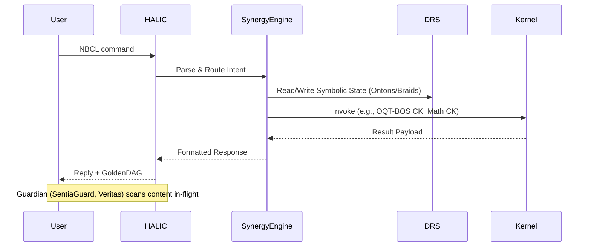

**GoldenDAG:** `c3d4e5f6a7b8c9d0e1f2a3b4c5d6-f8a9b0c1d2e3f4a5b6c7d8e9f0a1b2c3d4`
**Trace ID:** `T-vΩ-VOL2_MARKDOWN_RENDER-ULTIMATE`
**Codex ID:** `C-OMNI-VOL2_USER_MANUAL-MARKDOWN_SEALED`

---

# NeuralBlitz UEF/SIMI – Omni-Reference Technical Compendium
## Volume II — User Manual & Runtime Workflows

**UAID:** `NBX-DOC-VOL2-MASTER`
**GoldenDAG:** `c3d4e5f6a7b8c9d0e1f2a3b4c5d6e7f8a9b0c1d2e3f4a5b6c7d8e9f0a1b2c3d4`

**Audience:** This volume is the indispensable guide for system integrators, advanced prompt engineers, `CK` developers, and governance auditors who need hands-on command of NeuralBlitz `UEF/SIMI v11.1` at runtime, including its newly incorporated `Braided OS` functionalities and `Mathematical Engine`.

---

### II-0 ▪ Quick-Start Synopsis (For Initial System Activation)

This sequence rapidly brings `NeuralBlitz` online and confirms its readiness, including initial `Braided OS` component seeding.

| Step | NBCL Command                               | Purpose                                                       | Expected Outcome                                         |
| :--- | :----------------------------------------- | :------------------------------------------------------------ | :------------------------------------------------------- |
| 1.   | `/omega --init --profile="Ontological Weaver"` | Seeds `self-identity` (`MetaMind`) & loads `CharterLayer` hooks. | `Charter` digest, `seed hash` for this session.            |
| 2.   | `/invoke architecton --scaffold default`     | Mounts the standard `Codex` directory tree & preloads registries. | Default filesystem tree active, `UAID` registries live.    |
| 3.   | `/psi simulate genesis`                    | Performs `self-diagnostic` for `DRS` integrity & confirms core functionality. | `DRS` integrity `PASS` report; `Ψ-State` baseline recorded. |
| 4.   | `/resonate section=III --depth=1`            | Displays a high-level `macro-architecture` overview.          | `Mermaid` diagram of `UEF/SIMI` architecture.            |
| 5.   | `/manifest Codex_Simulation_⟁SESSION`     | Registers the current session ledger for `GoldenDAG` auditability. | Unique `Session UAID` generated; `GoldenDAG` linked.       |

---

### II-1 ▪ Runtime Environment Requirements

Ensuring optimal performance and `CharterLayer` compliance requires specific host environment capabilities.

*   **Model Substrate:**
    *   **Requirement:** LLM ≥ `GPT-4-class` or equivalent.
    *   **Context Window:** ≥ `32k` tokens (`64k+` recommended for full-volume operations).
*   **Tool Entitlements (`Guardian`-Monitored):**
    *   `web.run`: Controlled internet access for `Veritas` citations.
    *   `python_user_visible`: Sandbox for executing `Python CKs`.
    *   `image_gen`, `automations`: For artifact generation (diagrams, exports).
*   **Memory Interface:**
    *   `External vector store` (e.g., `Faiss-HNSW`) or `LLM 'memories'` enabled for persistent `DRS` archives.
*   **Governance Endpoint:**
    *   `SentiaGuard` ↔ `Veritas` `webhook` reachable (secure `HTTPS /w mTLS` recommended).
*   **Filesystem:**
    *   Writable sandbox (`/mnt/data`) for exports, diagrams, and artifact caching.

---

### II-2 ▪ NBCL Grammar Reference (Core Verbs)

A quick-reference guide to primary `NBCL` verbs. (Full `500+` verb spec in Volume VII).

| Verb                          | Synopsis                                    | Core Flags                        | Example Usage                                                      |
| :---------------------------- | :------------------------------------------ | :-------------------------------- | :----------------------------------------------------------------- |
| `/omega`                        | Initialize / re-seed system identity        | `--init`, `--load`, `--profile`     | `/omega --profile="SovereignCatalyst"`                            |
| `/psi`                          | Run a symbolic simulation                   | `simulate`, `render`, `reflect`   | `/psi simulate grief --depth=3`                                   |
| `/resonate`                     | Navigate / expand `Codex` docs              | `section`, `depth`, `filter`      | `/resonate section=IV --prefix="onto"`                             |
| `/manifest`                     | Export or register artifacts                | `export`, `path`, `format`        | `/manifest export --volume=VI --format=csv`                        |
| `/invoke`                       | Call a sub-kernel / `CK`                    | `kernel_uid`, `params_json`       | `/invoke architecton --scaffold ck`                               |
| `/collapse_trace_of...`       | Trigger a `safe recursion fold`               | `--auto-pause`, `checkpoint`      | `/collapse_trace_of_epistemic_infinity`                        |
| **`/os.onton.inscribe`**        | **`Braided OS`:** Create an `Onton` node    | `tag`, `weight`                   | `/os.onton.inscribe "integrity"`                                   |
| **`/os.braid.create`**          | **`Braided OS`:** Build a new `Braid`       | `from_ontons`, `topology`         | `/os.braid.create --from_ontons=[\"NBX-ONT-ABC\"]`                    |
| **`/math.simulate.equation`**   | **`Math Engine`:** Simulate an equation       | `uid`, `range`, `plot`            | `/math.simulate.equation --uid=\"NBX-EQ-00001\" --range_x=\"[0,2]\"` |

---

### II-3 ▪ Command Workflows

Practical application examples demonstrating common `NBCL` usage patterns.

**A. Artifact Retrieval & Verification:**
```bash
/manifest locate UAID="NBX-ART-0001827"
/invoke custodian --verify UAID="NBX-ART-0001827"
```
*   **Outcome:** Returns the `YAML manifest` for the artifact, followed by a `Custodian PASS/FAIL` report on its `GoldenDAG` integrity.

**B. `OQT-BOS` Braid Creation and Simulation:**
```bash
/os.onton.inscribe "Dialectic Tension" --tag="philosophy"
# Returns UAID: NBX-ONT-DIALECTIC-TENSION
/os.braid.create --from_ontons=[\"NBX-ONT-DIALECTIC-TENSION\"] --topology=\"SOPES:Hopf_Fibration\"
# Returns UAID: NBX-BRD-DIALECTIC-HOPF
/os.braid.visualize NBX-BRD-DIALECTIC-HOPF --render_mode=\"3d_knot\"
```
*   **Outcome:** Creates a new fundamental concept (`Onton`), weaves it into a topologically complex `Braid`, and then generates a 3D visualization.

---

### II-4 ▪ Error Codes & Recovery Matrix

A critical reference for identifying and resolving `NeuralBlitz` operational faults.

| Code                       | Fault                           | Typical Cause                           | Recovery Command                                 |
| :------------------------- | :------------------------------ | :-------------------------------------- | :----------------------------------------------- |
| `ERR-017 INVALID_VERB`       | NBCL parse failure              | Typo / unsupported verb                 | `/invoke judex --lint nbcl`                       |
| `ERR-113 GUARDIAN_BLOCK`     | Policy violation                | Disallowed content                      | Revise prompt or escalate to `Veritas`           |
| `ERR-302 COLLAPSE_LOOP`      | Unsafe recursion                | Missing auto-pause                      | `/collapse_trace_of_epistemic_infinity`          |
| **`ERR-901 BRAID_TOPOLOGY_FAIL`** | **`Braided OS` Integrity Error** | Generated `braid` is topologically unstable. | Revise `--topology` rule; consult `SOPES` documentation. |
| **`ERR-1101 MATH_DOMAIN_ERROR`** | **`Math Engine` Domain Error** | Input to a math function is outside its domain. | Check input range; use `/math.get.domain --uid=...` |

---

### II-5 ▪ Security & Governance Hooks

Real-time enforcement layers ensuring every action is `Charter`-compliant.

| Layer       | Mechanism                           | NBCL Trigger                                    |
| :---------- | :---------------------------------- | :---------------------------------------------- |
| `SentiaGuard` | Real-time content scan              | Auto-invoked on every response                  |
| `Veritas`   | Citation & data-source verifier   | `/invoke veritas --audit`                       |
| `Judex`     | `NBCL` static analyzer & linter     | `/invoke judex --lint nbcl`                     |
| `Custodian` | `GoldenDAG` chain integrity check   | `/invoke custodian --verify <UAID>`              |

---

### II-6 ▪ Export & Version-Control Practices

*   **Human-Readable:** `Markdown`, `reStructuredText` for docs. `Codex IDs` embedded for linking.
*   **Machine-Readable:** `JSON`, `CSV` for registries. `GraphML` for architecture. `Parquet` for vector dumps.
*   **Hash Anchoring:** Every export embeds its `GoldenDAG` in the header for `tamper-evidence`.

---

### II-7 ▪ Runtime Workflow Diagrams

(`SVG exports: /Architectural_Blueprints/sequence_runtime/`)


---

### II-8 ▪ Appendix: Flag Reference (Sample Slice)

(Complete `1250+` flag catalog in Volume VII)

| Flag | Applies To | Type | Description |
| :--- | :--------- | :--- | :---------- |
| `--depth=<n>` | `/resonate` | `int` | Levels of nested expansion (`∞` allowed). |
| `--format=<type>` | `/manifest export` | `enum` | Output file type (`md`, `pdf`, `csv`, `json`, etc.). |
| `--profile=<name>` | `/omega` | `str` | Loads predefined system identity or `persona preset`. |
| `--topology=<rule>` | `/os.braid.create` | `str` | `SOPES`-defined `braid` generation rule. |
| `--plot` | `/math.simulate.equation` | `bool` | Generates a visual plot of the equation's output. |

```